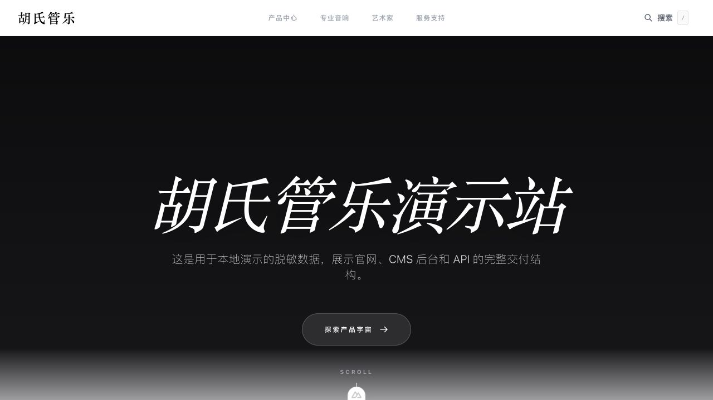
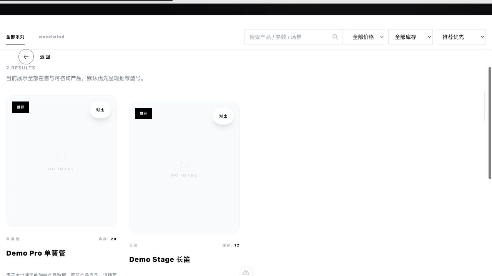
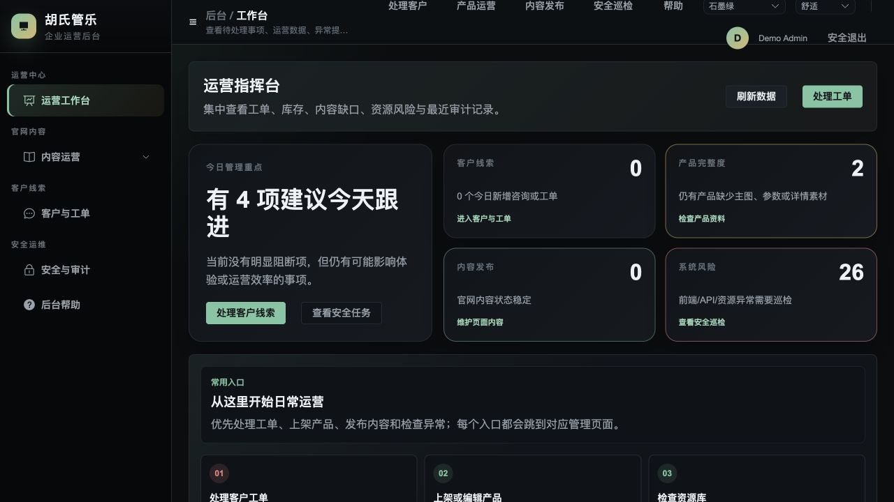

# 胡氏管乐官网

> 项目定位：真实业务网站交付样板，展示前台官网、后台 CMS、API、Prisma、SQLite、本地部署与基础安全校验能力。公开仓库保留完整的虚构品牌内容与开源许可素材，但不提交生产密钥、运行数据库或临时上传文件。

## 10 分钟运行路径

```bash
npm run install:all
npm run seed:demo
npm run dev
```

访问入口：

- 前台官网：`http://127.0.0.1:3000`
- 后台管理：`http://127.0.0.1:5175`
- API 健康检查：`http://127.0.0.1:1337/health`

后台演示账号：

```text
demo_admin / DemoPass_2026!
```

需要录制作业、作品集或面试演示时，按 [`docs/demo-script.md`](docs/demo-script.md) 的三端分镜执行；整个演示只依赖仓库内的虚构内容和本地数据，不要求线上服务器可用。

## 演示截图

### 官网首页



### 商品目录



### CMS 运营后台



## 技术栈

- 前台：Nuxt 4 / Vue 3 / Tailwind CSS
- 后台：Vue 3 / Vite / Element Plus
- API：Node.js / Express / Prisma / SQLite
- 工程：本地 seed、健康检查、生产构建保护、部署前检查脚本

## 可以展示的能力

- 前台浏览产品、文章、支持内容和品牌页面。
- 后台登录后管理产品、文章、FAQ、页面内容和线索。
- API 统一提供内容接口、后台鉴权、健康检查、安全响应头和生产配置校验。
- Prisma schema 管理业务表结构，SQLite 支持本地演示与交付。

## 公开仓库说明

- `aural-api/prisma/dev.db`、`backups/`、临时上传文件和 `.env` 不进入公开仓库；`uploads/real-assets`、演示资源及素材来源说明会保留。
- `npm run seed:demo` 会生成完整的虚构商品、文章、艺术家、支持内容和 demo 管理员。
- 品牌故事、商品型号、人物、联系方式和业务数据均为作品集虚构内容；图片来自 Pexels / Unsplash，来源与许可记录见 [`aural-api/uploads/asset-sources.json`](aural-api/uploads/asset-sources.json)。
- 生产构建必须显式传入正式域名，避免把 localhost 打进产物。

## 边界

该项目不是大型通用 CMS。权限模型、审计日志、运营分析、对象存储、自动化发布和多环境 CI/CD 仍是后续升级方向。
