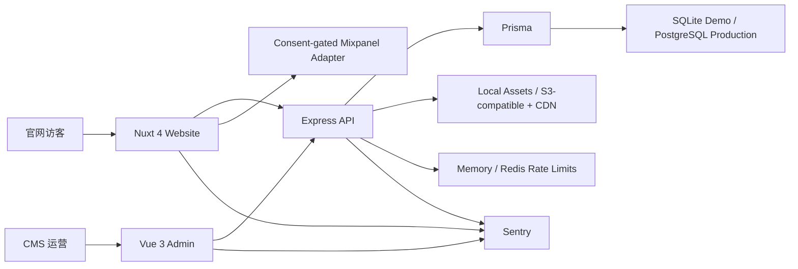
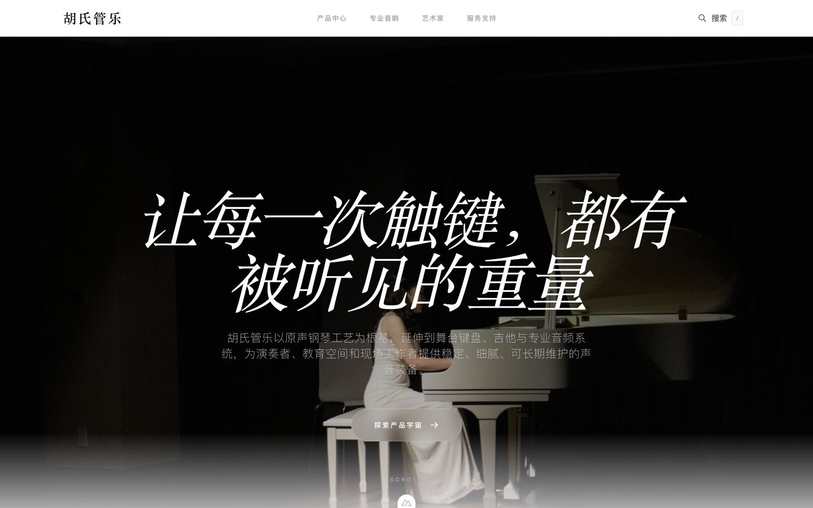
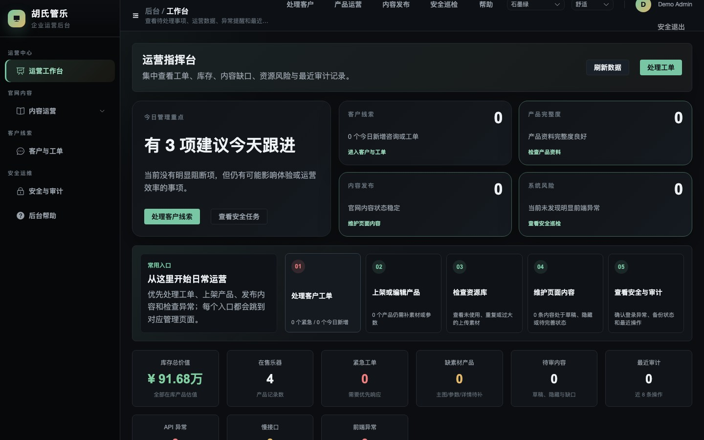
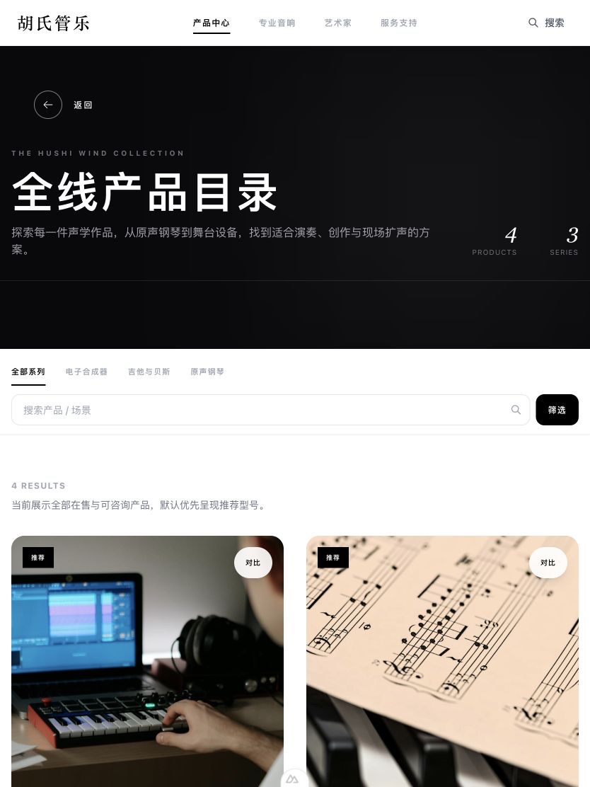
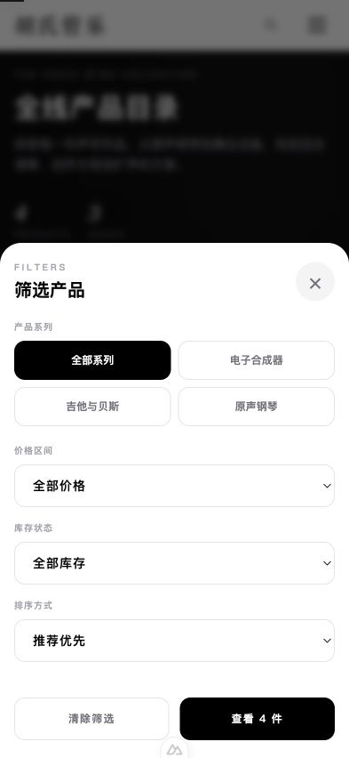

# 胡氏管乐官网

胡氏管乐是一套可独立部署的商业官网样板：Nuxt 4 官网、Vue 3 CMS 与 Express/Prisma API 共用一套内容、权限、审计和可观测性边界。仓库只包含虚构 Demo 数据和已记录来源的公开素材，不包含客户数据、生产数据库或密钥。

## 本地复现

要求 Node.js 22+ 与 `sqlite3` CLI。

```bash
npm run install:all
npm run seed:demo
npm run dev
```

- 官网：`http://127.0.0.1:3000`
- CMS：`http://127.0.0.1:5175`
- API 健康检查：`http://127.0.0.1:1337/health`
- 本地 Demo 账号：`demo_admin / DemoPass_2026!`

Demo 账号只能用于本机或演示环境。生产启动会拒绝 Demo 值、弱密码、示例域名、`Replace-*` 密码和占位 token。

## 质量门禁

```bash
npm run lint
npm run test
npm run test:e2e
npm run backup:verify
npm run quality
```

`npm run test` 覆盖 API 集成测试、Nuxt 组件/composable/SEO/结构化数据测试与 CMS 单元测试。Playwright 覆盖官网搜索、筛选、对比、询价提交以及 CMS 登录、发布和版本恢复，同时执行桌面/手机响应式和 axe 可访问性检查。

GitHub Actions 在 push/PR 上执行 lint、三端测试、Prisma SQLite/PostgreSQL 校验、备份恢复、生产构建、Playwright 与依赖安全审计。

## 架构与运行模式



- Demo：SQLite + 本地素材 + 内存限流，可完全离线复现。
- Staging：可使用单实例 SQLite，但必须使用独立域名、密钥和数据。
- Production：PostgreSQL、S3 兼容对象存储/CDN、Redis 共享限流、JSON 日志与三端 Sentry。

详见 [架构说明](docs/architecture.md)、[部署与回滚](docs/deployment.md)、[测试与验收](docs/testing-and-acceptance.md)、[可观测性](docs/observability.md) 和 [转化事件规范](docs/analytics.md)。

## 安全摘要

- CMS 使用有时限会话、RBAC、可选 2FA、每会话 CSRF token、CORS 白名单、登录锁定与 IP 白名单。
- 写操作、导出、备份和版本恢复写入审计记录。
- 上传校验 MIME、文件签名、大小、图片像素与安全文件名；可外接 ClamAV 扫描。
- 日志和 Sentry 默认不发送请求体、cookie、header 或用户 PII；转化分析会删除姓名、电话、邮箱、地址、留言和 token 类字段。

漏洞报告方式与响应级别见 [SECURITY.md](SECURITY.md)。

## 截图






### 响应式验收





## 发布

发布前必须通过 [`docs/release-checklist.md`](docs/release-checklist.md)。生产环境文件必须从 `*.env.production.example` 复制后全部替换，不得将 `.env`、备份、数据库或客户上传文件提交到 Git。

本项目以 [MIT License](LICENSE) 发布；图片来源另见 [`aural-api/uploads/asset-sources.json`](aural-api/uploads/asset-sources.json)。
