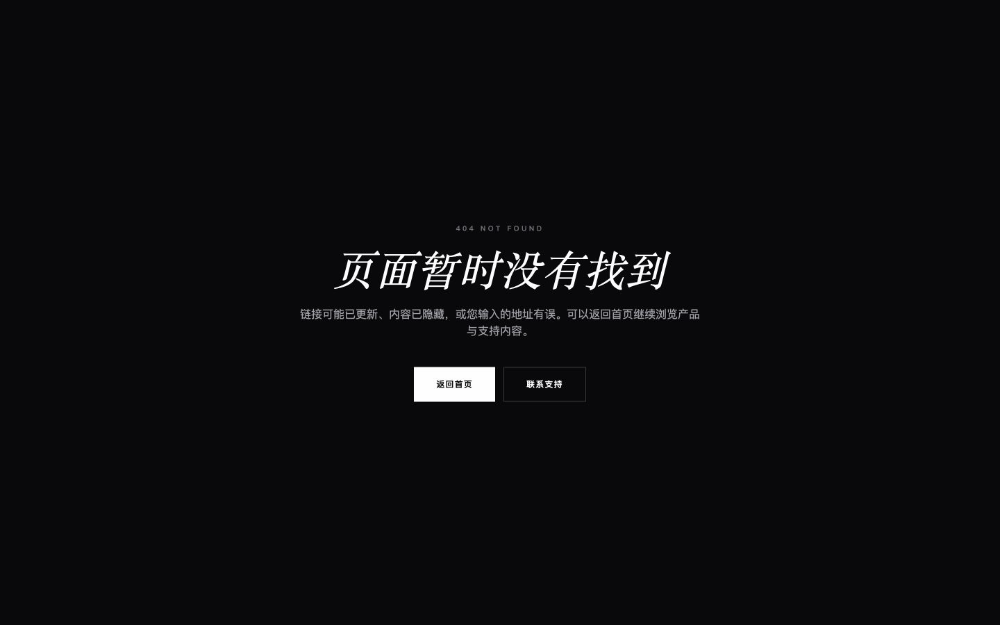
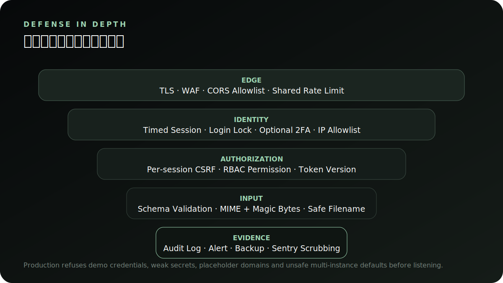

# 胡氏管乐官网

**简体中文** · [English](README.en.md)


[](https://github.com/728792899-create/hushi-wind-website/actions/workflows/ci.yml)


[](LICENSE)

这是一套可独立部署、可持续运营的乐器品牌全栈官网：**Nuxt 4 公开官网 + Vue 3 运营 CMS + Express/Prisma API**。项目保留高端黑白视觉，同时补齐测试、响应式体验、SEO、权限、审计、备份、可观测性和生产配置边界。

> 仓库仅包含虚构 Demo 数据和已记录来源的公开素材，不包含客户数据、生产数据库、密钥或私有上传文件。

## 目录

- [项目能力](#项目能力)
- [界面导览](#界面导览)
- [系统架构](#系统架构)
- [本地复现](#本地复现)
- [测试与质量门禁](#测试与质量门禁)
- [安全与隐私](#安全与隐私)
- [生产部署](#生产部署)
- [文档中心](#文档中心)

## 项目能力

| 领域 | 能力 | 实现要点 |
| --- | --- | --- |
| 官网 | 首页、产品、详情、搜索、筛选、对比、新闻、艺术家、音响、服务 | Nuxt SSR、响应式布局、全局状态、焦点管理 |
| 转化 | 产品对比、资料下载、预约试奏、咨询提交 | 独立表单限流、honeypot/时间守卫、非 PII 分析事件 |
| CMS | 产品、文章、页面、FAQ、资源、线索与仪表盘 | Vue 3、Element Plus、路由懒加载、高密度运营视图 |
| 内容安全 | 发布、版本记录、历史恢复、操作审计 | 写操作保留 before/after 证据，恢复也进入日志 |
| 账号安全 | 限时会话、RBAC、2FA、CSRF、锁定、IP 白名单 | 菜单、按钮和 API 权限点同源 |
| 上传 | 本地素材与 S3-compatible 对象存储 | MIME、magic bytes、大小、像素、安全文件名校验 |
| 数据 | SQLite Demo / PostgreSQL Production | 双 Prisma schema、已提交迁移、备份恢复演练 |
| 可观测性 | 三端 Sentry、JSON 日志、健康检查、告警 | release/environment 标识、默认 PII 脱敏 |
| 交付 | staging/production 配置、CI、备份、回滚 | GitHub Actions、部署前检查、部署后冒烟 |

## 界面导览

### 官网首页与产品目录

| 品牌首页 | 产品目录 |
| --- | --- |
|  |  |

首页用于建立品牌信任与主要入口；产品目录提供类目、价格、库存、排序和关键词筛选。

### 产品对比与咨询

| 产品选型对比 | 咨询报价表单 |
| --- | --- |
|  |  |

对比弹窗支持键盘焦点限制、Escape 关闭和关闭后焦点返回；咨询成功以 API `201` 为准，不会把表单内容复制到分析平台。

### 产品详情：桌面与手机

| 桌面产品详情 | 手机产品详情与悬浮 CTA |
| --- | --- |
|  |  |

详情页保持产品名、系列、主图、参数和下一步动作在同一决策上下文中；手机端保留可触达的固定 CTA，并避开系统安全区。

### CMS 运营与安全中心

| 运营工作台 | 权限与审计中心 |
| --- | --- |
|  |  |

### CMS 内容、客户与恢复证据

| 产品编辑 | 版本记录与恢复 |
| --- | --- |
|  |  |

| CRM 咨询队列 | 素材资源库 |
| --- | --- |
|  |  |

| 备份恢复演练 | 官网 404 状态 |
| --- | --- |
|  |  |

截图只使用重新 seed 的虚构 Demo 数据；采集中的咨询、内容修改和备份记录不会作为仓库数据提交。

### 手机与平板

| 平板产品目录 | 手机产品筛选 | 手机导航 |
| --- | --- | --- |
|  |  |  |

更完整的业务操作说明见 [产品与用户旅程](docs/product-tour.md) 和 [CMS 运营手册](docs/admin-guide.md)。

## 系统架构


- 公开官网只读取已发布内容并提交公开表单。
- CMS 写操作必须携带管理员会话与每会话 CSRF token，再通过 permission 校验。
- API 是唯一数据和素材边界；前端不直连数据库。
- 产品与咨询域使用 route → controller → service → repository 分层，校验、权限与 HTTP 错误独立。

```text
hushi-wind-website/
├── aural-website/          # Nuxt 4 公开官网
├── aural-admin/            # Vue 3 / Element Plus CMS
├── aural-api/              # Express / Prisma API
│   ├── prisma/            # SQLite + PostgreSQL schema/migrations
│   ├── src/               # 路由、控制器、服务、仓储、安全与监控
│   └── scripts/           # 备份、迁移、部署、健康与演练
├── docs/                   # 产品、架构、API、运维与验收文档
├── .github/workflows/      # CI 质量、E2E 与安全工作流
└── scripts/dev.mjs         # 三端联合启动器
```

详细时序、数据流和权限边界见 [架构说明](docs/architecture.md)。

## 本地复现

### 要求

- Node.js 22+
- npm 10+
- `sqlite3` CLI（一致性备份和恢复演练需要）
- Chromium（首次 E2E 可用 Playwright 命令安装）

### 一键启动

```bash
git clone https://github.com/728792899-create/hushi-wind-website.git
cd hushi-wind-website
npm run install:all
npm run seed:demo
npm run dev
```

| 服务 | 本地地址 | 说明 |
| --- | --- | --- |
| 官网 | `http://127.0.0.1:3000` | Nuxt SSR 展示端 |
| CMS | `http://127.0.0.1:5175` | 运营与安全后台 |
| API | `http://127.0.0.1:1337` | Express API |
| 健康检查 | `http://127.0.0.1:1337/health` | 进程、Prisma 表与 SQLite 文件状态 |

本地 Demo 账号：

```text
demo_admin / DemoPass_2026!
```

Demo 账号仅能用于本机或受控演示。生产启动会拒绝 Demo 账号、弱密码、占位 token、示例域名和不安全的多实例配置。

### 常用开发命令

```bash
npm run dev                 # 三端联合启动
npm run dev:api             # 仅启动 API
npm run dev:website         # 仅启动官网
npm run dev:admin           # 仅启动 CMS
npm run seed:demo           # 重置为统一虚构数据
```

## 测试与质量门禁

| 层级 | 命令 | 当前覆盖 |
| --- | --- | --- |
| 文档 | `npm run docs:check` | 本地链接、锚点、图片、alt、真实 MIME、SVG 元数据和中英文配对 |
| Lint | `npm run lint` | JS/Vue 解析与高风险语义规则 |
| API 集成 | `npm run test:api` | 健康、鉴权、RBAC、CSRF、CRUD、上传、咨询、版本恢复、生产熔断 |
| 官网单测 | `npm run test:website` | 组件、筛选、SEO、JSON-LD、分析脱敏 |
| CMS 单测 | `npm run test:admin` | 会话/CSRF、仪表盘和安全视图模型 |
| Browser E2E | `npm run test:e2e` | 浏览、搜索、对比、咨询、CMS 发布/回滚、响应式、axe |
| 备份演练 | `npm run backup:verify` | SQLite 一致备份、恢复和行数/完整性对比 |
| 完整门禁 | `npm run quality` | 测试、Prisma 双 schema、安全审计和两端生产构建 |

当前自动化基线：**30 项单元/集成测试 + 4 条 Playwright E2E**。GitHub Actions 在 push/PR 时执行质量、E2E 和依赖安全三组作业。

详见 [测试、基线与验收](docs/testing-and-acceptance.md)。

## 安全与隐私



- 后台使用限时会话、每会话 CSRF token、RBAC、可选 2FA、登录锁定和 IP 白名单。
- 上传校验声明 MIME、文件签名、文件大小、图片像素与安全文件名；生产可外接 ClamAV。
- 写操作、版本恢复、导出和备份写入审计记录。
- API 日志与 Sentry 默认删除 body、cookies、headers、query string 和用户 PII。
- 分析事件会再次删除姓名、电话、邮箱、地址、留言、cookie 与 token 类字段。

安全问题请按 [SECURITY.md](SECURITY.md) 中的私密报告流程处理，不要直接在公开 Issue 中附带利用细节、客户数据或凭据。

## 转化与可观测性


官网定义了 `product_view`、`product_search`、`product_compare`、`resource_download`、`inquiry_start` 和 `inquiry_submit` 六个稳定事件。Mixpanel 只在公开功能开关打开、用户明确同意且部署层已注入 SDK 时转发。


官网、CMS 和 API 使用同一不可变 release 标识；Nuxt 仅在存在 DSN 时注入 Sentry SDK，只有构建凭据完整时才生成并上传 source maps。

详见 [转化事件规范](docs/analytics.md) 和 [可观测性与告警](docs/observability.md)。

## 生产部署

| 环境 | 数据库 | 素材 | 限流 | 用途 |
| --- | --- | --- | --- | --- |
| local/demo | SQLite | 本地 `uploads` | 进程内存 | 开发、演示、自动化验收 |
| staging | PostgreSQL 优先 | 独立 bucket/CDN | Redis | 迁移、恢复、容量与发布验收 |
| production | PostgreSQL + PITR | S3-compatible + CDN | Redis + WAF | 多实例生产运行 |


推荐顺序：质量门禁 → 不可变构建 → 可验证备份 → Prisma 迁移 → API 健康检查 → Nuxt/CMS 发布 → 业务冒烟 → 30 分钟观察窗口。

具体变量、命令、备份和回滚决策见 [部署文档](docs/deployment.md) 与 [运维 Runbook](docs/operations-runbook.md)。

## 文档中心

| 读者 | 文档 | 解决的问题 |
| --- | --- | --- |
| 新访客 | [文档导航](docs/documentation-index.md) | 按角色找到最短阅读路径 |
| 贡献者 | [开发者指南](docs/developer-guide.md) | 仓库结构、本地循环、分层边界与 PR 自检 |
| 产品/业务 | [产品与用户旅程](docs/product-tour.md) | 官网如何完成从浏览到咨询的转化 |
| 运营人员 | [CMS 运营手册](docs/admin-guide.md) | 内容发布、回滚、CRM、资源和安全巡检 |
| 前后端开发 | [架构说明](docs/architecture.md) | 边界、时序、权限和数据流 |
| 配置维护者 | [环境变量参考](docs/configuration-reference.md) | 三端变量、环境差异与生产约束 |
| 数据维护者 | [数据模型与内容生命周期](docs/data-model.md) | 核心实体、状态、版本与恢复语义 |
| 安全负责人 | [RBAC 与安全模型](docs/security-and-permissions.md) | 会话、权限、2FA、CSRF、审计和默认凭据保护 |
| 设计/前端 | [设计系统与无障碍](docs/design-system-and-accessibility.md) | 令牌、状态组件、键盘和响应式验收 |
| API 集成方 | [API 使用指南](docs/api-reference.md) | 端点分类、会话、CSRF、错误和上传合同 |
| QA | [测试与验收](docs/testing-and-acceptance.md) | 自动化层级、视口和性能/可访问性口径 |
| DevOps/SRE | [部署与回滚](docs/deployment.md) | 环境、迁移、备份、发布顺序 |
| 值班人员 | [运维 Runbook](docs/operations-runbook.md) | 告警、故障分级、恢复与证据保留 |
| 排障人员 | [常见故障排查](docs/troubleshooting.md) | 安装、端口、登录、构建、上传和恢复问题 |
| 数据/产品 | [转化事件规范](docs/analytics.md) | 事件合同、隐私边界和 funnel |
| 发布负责人 | [Release Checklist](docs/release-checklist.md) | 可勾选的上线与观察清单 |

## 素材、贡献与 License

- 仓库中的官网图片是 Demo 资料，上线必须替换为品牌授权或来源可验证的真实产品照片。
- 素材来源记录见 [`aural-api/uploads/asset-sources.json`](aural-api/uploads/asset-sources.json)。
- 提交 PR 前请运行 `npm run quality` 和与改动相关的 E2E，并在说明中附上验证证据。
- 项目代码以 [MIT License](LICENSE) 发布；图片授权不因代码 License 自动扩展。

当前已知边界见 [剩余风险](docs/known-limitations.md)。
