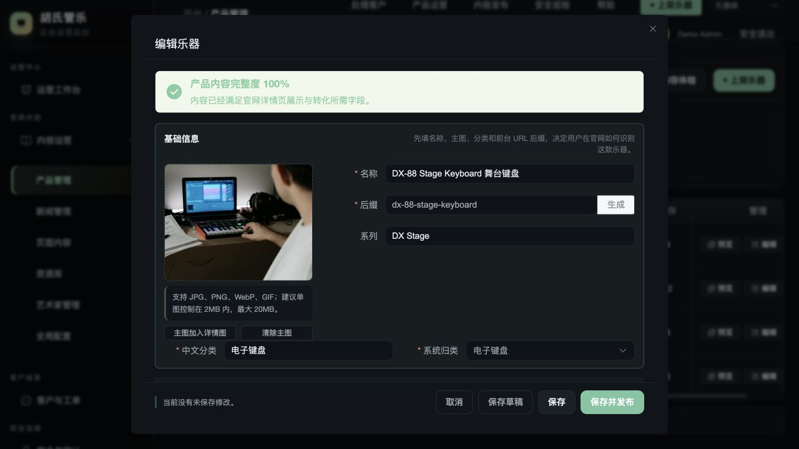
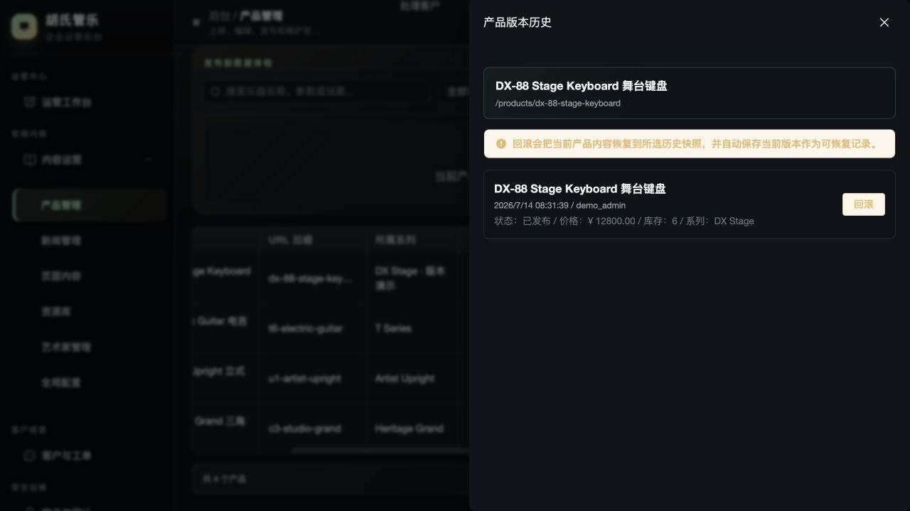
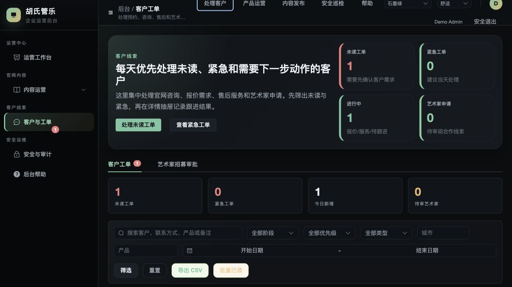
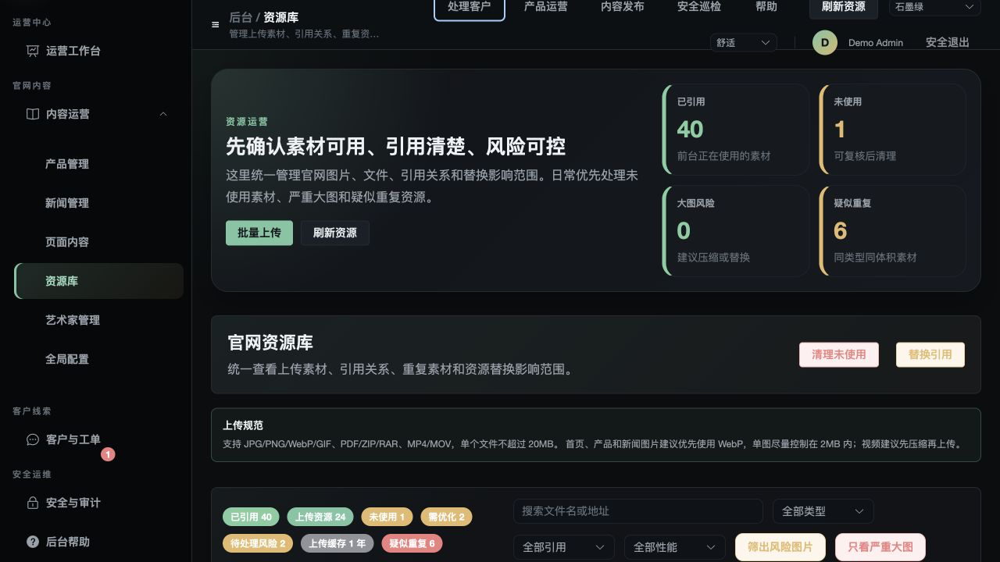
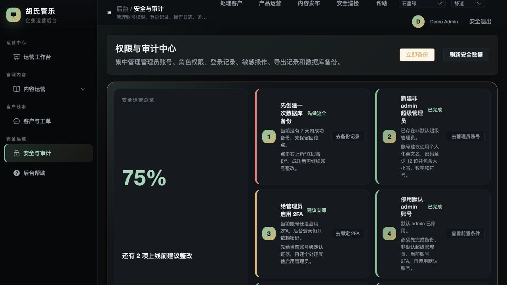
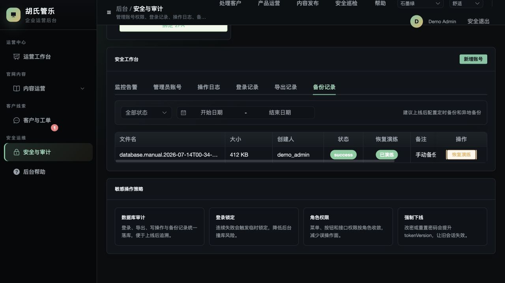

# CMS 运营手册

**简体中文** · [English](en/admin-guide.md)

这份手册面向内容运营、客服、管理员和发布负责人。CMS 不是另一套静态原型，它通过鉴权 API 维护官网同一套业务数据。

## 登录与会话

本地 Demo：

```text
URL: http://127.0.0.1:5175
Username: demo_admin
Password: DemoPass_2026!
```

Demo 账号不能用于生产。生产应为每名管理员创建独立账号，使用强密码并绑定 2FA。

登录成功后 CMS 仅在 `sessionStorage` 保留限时 token 与 CSRF token；关闭会话、修改/重置密码或账号 tokenVersion 变更后，旧会话失效。

## 运营工作台


工作台用于回答“今天先处理什么”：

- 新咨询、紧急工单和 CRM 待办。
- 产品主图、参数或详情缺口。
- 草稿、隐藏或待完善内容。
- API 500、慢请求、前端错误与资源失败。
- 最近备份、登录异常、未处理告警和操作审计。
- 产品浏览、表单打开、提交和热门搜索的漏斗。

这里的“上线就绪度”是运营检查清单，不等同于代码 CI 已通过。发布前两者都必须满足。

## 角色与权限

| 角色 | 适合人员 | 关键权限 |
| --- | --- | --- |
| `super_admin` | 少量系统负责人 | 全部权限，包括账号与安全设置 |
| `operations` | 运营管理员 | 产品、文章、CMS、艺术家、配置、资源、日志、备份 |
| `support` | 客服/销售支持 | CRM 读写、私密字段和导出 |
| `editor` | 内容编辑 | 文章、页面、FAQ、艺术家；产品/资源/配置为读取 |
| `readonly` | 审核、管理者或观察员 | 业务、资源、CRM、配置和日志只读 |

不要通过只隐藏前端按钮来实现权限。API 会对每个受保护端点再次校验 permission。

## 发布一个产品



1. 进入“产品运营”。
2. 创建或编辑产品，确认标题、slug、类目、系列和状态。
3. 上传真实授权主图，再补充 gallery、参数、场景、售后与 SEO 文字。
4. 如有公开价，确认币种与价格；如为询价，不要使用虚假价格占位。
5. 先保存草稿并在预览/本地环境检查。
6. 切换为 `published`，然后到官网验证目录、详情、对比、图片 alt 和 JSON-LD。

发布前最低内容标准：

- 主图与产品名一致，来源可验证。
- 描述不使用无法证明的“第一”、“唯一”或虚假认证。
- 参数、库存、价格/询价状态和保修说明相互一致。
- 主图、详情图和外部资料链接均可访问。
- 中文标题和 SEO description 不为空。

## 版本恢复



编辑产品、文章或通用 CMS 内容时，API 会保留历史快照。

1. 打开内容的版本列表。
2. 根据时间、操作人和变更摘要选择目标版本。
3. 恢复前先复核是否会覆盖当前有效修改。
4. 执行恢复并确认成功反馈。
5. 到官网验证已发布结果。
6. 到操作日志确认 restore 行为已记录。

版本恢复是业务内容回滚，不等同于数据库备份恢复。

## 咨询与工单



- 先处理紧急工单与新咨询。
- 查看线索时遵守最小权限和内部用途，不把联系信息复制到公开文档、Issue 或分析平台。
- 只有具备 `crm:write` 的角色可更新状态或删除。
- 导出前确认目的、范围和接收人；导出会保留审计记录。
- 不需要的个人信息按数据保留政策清理。

## 资源库



上传前：

- 确认图片来源和授权。
- 按用途输出尺寸，不上传无限制大图。
- 文件名不包含客户姓名、电话、项目机密信息或路径符号。
- 为官网图片准备简洁准确的 alt 文本。

删除前 CMS 会检查产品、文章、配置、下载、艺术家和视频等引用；仍被使用的资源会拒绝删除。

## 安全与审计中心



建议按页面给出的顺序整改：

1. 先创建并验证数据库备份。
2. 创建非默认、个人化的超级管理员。
3. 为当前与其他高权限账号绑定 2FA。
4. 验证新账号能完成登录与关键操作。
5. 再停用默认账号。
6. 处理未完成告警，确认上线就绪度无严重项。

要检查的页签包括监控告警、管理员账号、操作日志、登录记录、导出记录和备份记录。



## 每日/每周检查

### 每日

- 新咨询、紧急工单和未读线索。
- 严重/警告级未处理告警。
- API 500、慢请求、前端错误和表单失败。
- 当日内容发布与审计记录是否一致。

### 每周

- 备份最近成功时间与验证状态。
- 长期未使用资源、重复文件和过大图片。
- 管理员账号、角色、2FA 覆盖和异常登录。
- 无结果搜索、未解决 FAQ 和低转化页面。
- 草稿、隐藏内容和产品资料缺口。

## 不要这样做

- 不要在生产使用 Demo 账号或共享管理员。
- 不要为了通过页面就绪度而伪造备份、2FA 或监控状态。
- 不要在没有备份和验证新管理员的前提下停用唯一高权限账号。
- 不要在公开 Issue、截图或分析平台中放入客户联系信息。
- 不要用生成图或来源不明图片冒充真实产品照片。
