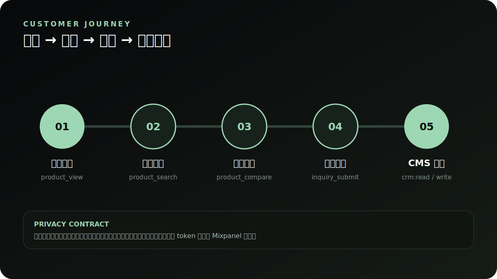
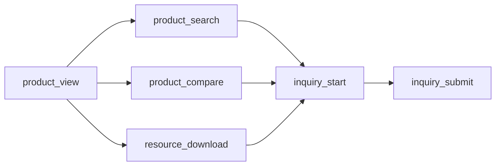

# 产品转化事件规范

**简体中文** · [English](en/analytics.md)

## 目标漏斗

| Event | 触发时机 | 允许属性 |
| --- | --- | --- |
| `product_view` | 产品详情页成功呈现 | `entityId`, `entityTitle`, `source`, `category` |
| `product_search` | 2 字符以上搜索停顿 650ms | `searchTerm`, `resultCount`, 非 PII 筛选值 |
| `product_compare` | 加入对比或打开对比面板 | 产品 ID/标题列表、`stage` |
| `resource_download` | 用户点击资料下载 | 资料 ID/标题/类型，不保存完整外部 URL |
| `inquiry_start` | 打开或首次与询价表单交互 | `source`, `inquiryType`, `productId` |
| `inquiry_submit` | API 已成功创建线索 | `source`, `inquiryType`, `productId`; 不发送表单值 |

## Mixpanel 接入

`NUXT_PUBLIC_MIXPANEL_ENABLED=true` 只是功能开关。只有当用户明确同意且 `localStorage['hushi:analytics-consent'] === 'granted'` 时，官网才会将事件转发给已由部署层注入的 `window.mixpanel`。未同意时仍可使用 API 的第一方汇总，但不应生成跨站身份。

建议在 Mixpanel 建立两个 funnel：

1. 选型漏斗：`product_view` → `product_compare` → `inquiry_start` → `inquiry_submit`。
2. 搜索漏斗：`product_search` → `product_view` → `inquiry_submit`。

分组仅使用 `source`、`category`、`inquiryType`、设备尺寸等非个人属性。不得 identify 电话/邮箱，不得将姓名、联系方式、地址、留言、cookie、token、序列号或原始 IP 放入分析属性。`sanitizeAnalyticsMetadata` 在客户端对这些键二次过滤。

## 数据质量

- `inquiry_submit` 以 API 201 为成功条件，不以点击按钮为条件。
- 事件名是稳定合同，展示文案不应作为 event name。
- 新增属性前先通过隐私审查与单元测试，只保留支持一个已写明业务问题的属性。
- API 端分析保留期由 `ANALYTICS_RETENTION_DAYS` 控制，定时运行 `cleanup:analytics`。
