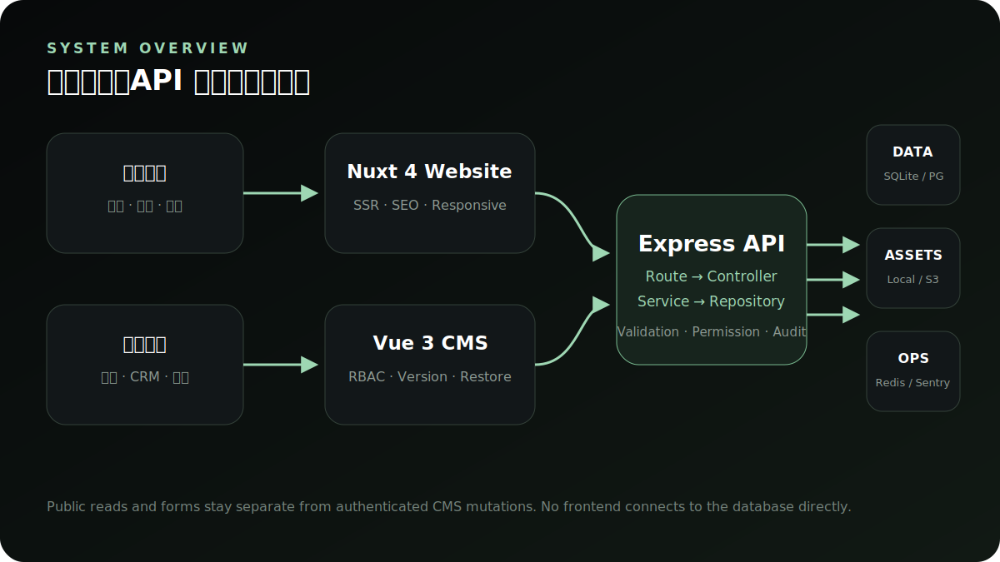

# API 使用指南

**简体中文** · [English](en/api-reference.md)

默认本地 API Base URL：`http://127.0.0.1:1337`。这份文档介绍稳定的端点类别、鉴权约定和安全边界；不替代以代码中 validation 为准的字段级 schema。



## 健康与公开读取

| 方法 | 路径 | 用途 |
| --- | --- | --- |
| GET | `/health` | 进程、Prisma 核心表和 SQLite 文件健康 |
| GET | `/api/health` | 与 `/health` 等价的 API 命名空间入口 |
| GET | `/api/config` | 官网公开配置，不返回密钥 |
| GET | `/api/products` | 已发布产品列表 |
| GET | `/api/articles` | 已发布文章列表 |
| GET | `/api/articles/:id` | 公开文章详情 |
| GET | `/api/artists` | 艺术家/合作者内容 |
| GET | `/api/support-faqs` | FAQ，可按 `category` 查询 |
| GET | `/api/support-downloads` | 公开资料下载 |
| GET | `/api/audio-solutions` | 专业音响方案 |
| GET | `/api/page-contents` | 通用页面内容 |

公开列表默认只返回可公开状态记录；草稿和隐藏内容不应因为知道 ID 就可被读取。

## 公开写入

| 方法 | 路径 | 保护 |
| --- | --- | --- |
| POST | `/api/inquiries` | 独立表单限流、字段校验、honeypot/时间守卫 |
| POST | `/api/artist-applications` | 公开申请校验与持久化 |
| POST | `/api/events` | 事件白名单和 metadata PII 过滤 |

公开写入不能因为无需登录就绕过字段长度、请求大小、频率、来源与日志脱敏约定。

## 管理员会话

### 1. 登录

```bash
curl -sS http://127.0.0.1:1337/api/auth/login \
  -H 'Content-Type: application/json' \
  -H 'Origin: http://127.0.0.1:5175' \
  --data '{"username":"demo_admin","password":"DemoPass_2026!"}'
```

响应包含限时 `token`、与该会话绑定的 `csrfToken`、`expiresIn` 和脱敏管理员信息。启用 2FA 的账号还需提交 6 位 `totpCode`。

### 2. 读操作

```http
Authorization: Bearer <session-token>
```

### 3. 写操作

```http
Authorization: Bearer <session-token>
X-CSRF-Token: <per-session-csrf-token>
Origin: https://admin.example.com
```

所有受保护非 GET/HEAD 请求必须通过会话、CSRF、CORS 和 permission 四层检查。

### 4. 会话维护

| 方法 | 路径 | 用途 |
| --- | --- | --- |
| GET | `/api/auth/session` | 验证会话并获取当前 CSRF token |
| POST | `/api/auth/refresh` | 换取新会话与 CSRF token |
| POST | `/api/auth/change-password` | 修改当前密码并使旧会话失效 |
| POST | `/api/auth/2fa/setup` | 创建 TOTP 绑定材料 |
| POST | `/api/auth/2fa/enable` | 验证动态码并启用 2FA |
| POST | `/api/auth/2fa/disable` | 关闭当前账号 2FA |

## 业务端点类别

### 产品

| 方法 | 路径 | 权限 |
| --- | --- | --- |
| GET | `/api/products` | 公开已发布列表；管理员可看更多状态 |
| GET | `/api/products/slug-check/:slug` | `products:read` |
| GET | `/api/products/:id/versions` | `products:read` |
| POST | `/api/products` | `products:write` |
| PUT | `/api/products/:id` | `products:write` |
| DELETE | `/api/products/:id` | `products:write` |
| POST | `/api/products/:id/restore/:versionId` | `products:write` |

### 咨询/CRM

| 方法 | 路径 | 权限 |
| --- | --- | --- |
| POST | `/api/inquiries` | 公开表单保护 |
| GET | `/api/inquiries` | `crm:read` |
| PUT | `/api/inquiries/:id/read` | `crm:write` |
| PUT | `/api/inquiries/:id` | `crm:write` |
| DELETE | `/api/inquiries/:id` | `crm:write` |

### 文章与通用 CMS 内容

文章使用 `articles:read/write`。FAQ、下载、音响方案/数据、品牌时间线、生态服务、快速指南和页面内容使用统一 `cms:read/write` 动态路由工厂，并支持 versions/restore。

### 账号、日志、备份与告警

| 端点组 | 主要权限 |
| --- | --- |
| `/api/admin/users*` | `admin:write` / `logs:read` |
| `/api/admin/login-records` | `logs:read` |
| `/api/admin/operation-logs*` | `logs:read` |
| `/api/admin/export-records*` | `logs:read` / `exports:create` |
| `/api/admin/backups*` | `logs:read` / `backups:create` |
| `/api/admin/alerts*` | `logs:read` |
| `/api/admin/ops-health` | `dashboard:read` |
| `/api/admin/analytics` | `dashboard:read` |

## 上传合同

`POST /api/upload` 使用 `multipart/form-data`，字段名为 `file`，需要管理员会话和写操作 CSRF。服务端会校验：

- 允许的 MIME 白名单。
- 文件内容 magic signature，不只信任扩展名。
- 文件大小和图片像素。
- 归一化安全文件名。
- 本地路径或 S3-compatible 对象键不逃出配置边界。

多实例生产不应把持久素材仅写入容器本地磁盘。

## 错误响应

标准错误包含稳定 `code` 和面向使用者的 `message`。客户端应按 HTTP status 与 code 处理，不应解析中文 message 作为程序分支。

| Status | 常见 code | 客户端动作 |
| --- | --- | --- |
| 400 | `VALIDATION_ERROR`, `INVALID_*` | 展示字段级错误，不重试相同请求 |
| 401 | `UNAUTHORIZED`, `INVALID_CREDENTIALS` | 清理本地会话并返回登录 |
| 403 | `FORBIDDEN`, `CSRF_INVALID` | 不自动提权；更新会话或联系管理员 |
| 404 | `NOT_FOUND` | 显示空状态或 404 |
| 409 | `RESOURCE_IN_USE`, slug/constraint 冲突 | 请用户修正冲突 |
| 423 | `ACCOUNT_LOCKED` | 停止重试，等待锁定结束或联系管理员 |
| 429 | `RATE_LIMITED` | 按 Retry-After/界面提示延迟重试 |
| 500 | `INTERNAL_ERROR` | 展示可重试状态并保留 release/request 线索 |

## 调用方安全清单

- 不把 token、CSRF、密码、TOTP secret 写入 URL、日志或分析事件。
- 不在前端保存 S3、数据库或 Sentry 上传凭据。
- 不为了调试在生产放开 `*` CORS。
- 发布前使用生产相同域名模型验证 Origin 与 CSRF。
- 所有新增事件 metadata 先通过隐私审查与单元测试。
