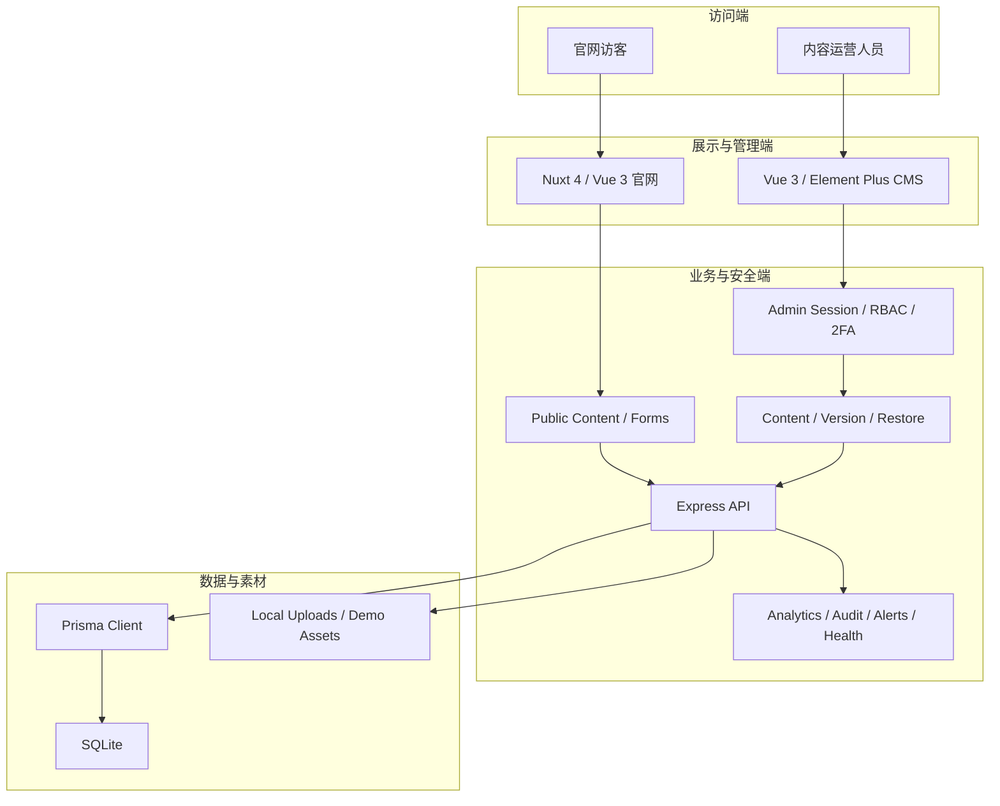
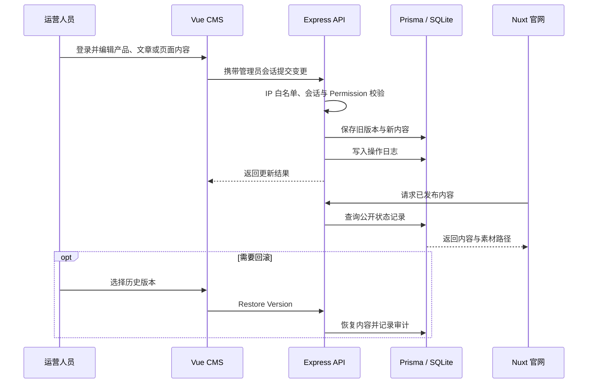
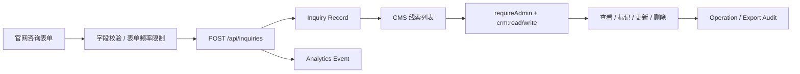
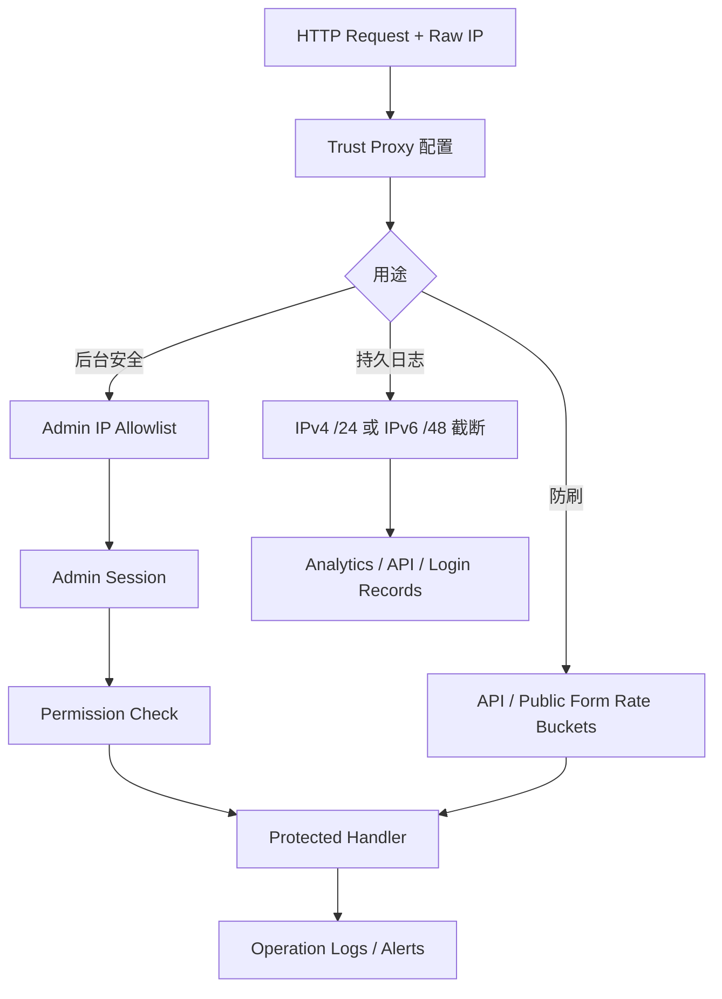
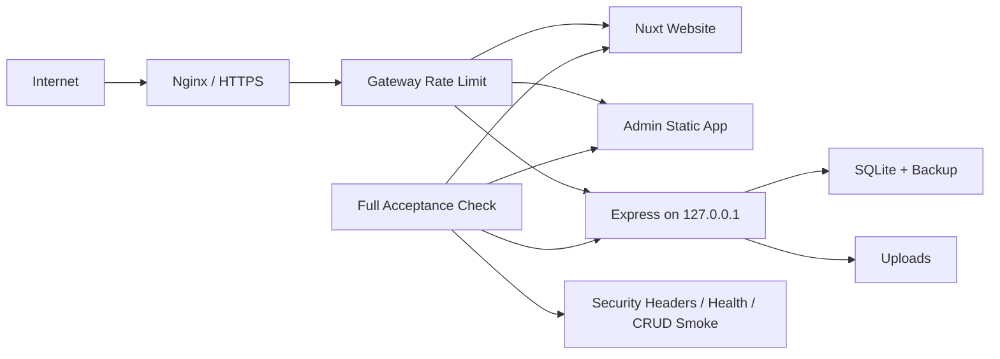

# 架构说明

## 1. 官网、CMS 与 API 三端架构

前台只消费公开内容接口并提交公开表单；后台的写操作必须经过管理员会话和权限点校验。API 是唯一数据边界，前端不直接连接数据库或读写上传目录。

## 2. CMS 内容发布与版本恢复

演示 seed 生成的是完整虚构品牌数据；产品、文章、FAQ 和页面内容不依赖历史线上服务器，便于本地复现三端闭环。

## 3. 公开咨询线索流

公开表单不复用宽松的普通内容读取路径：它有独立的请求桶、字段守卫和持久化记录；线索的读取、修改与导出只允许具备 CRM 权限的后台用户执行。

## 4. 鉴权、限流与日志隐私边界

IP 匿名化只发生在持久日志写库处。限流键与管理员 IP 白名单继续使用原始 IP，否则会降低防刷和访问控制的准确性。应用内 `Map` 限流是单实例兜底，多实例环境必须把网关限流作为第一道防线。

## 5. 生产部署与验收边界

- 开发态默认只监听回环地址；弱默认凭据与非本地监听组合会直接拒绝启动。
- 生产启动会检查管理员账号、密码、Token 等关键配置，前后台生产构建会拒绝 localhost API 地址。
- 上线验收脚本同时探测官网、后台和 API，并检查后台安全响应头，而不是只验证构建目录存在。
- SQLite 与本地上传适合当前交付规模；扩展为多实例前应迁移数据库、对象存储、共享限流与集中日志。
