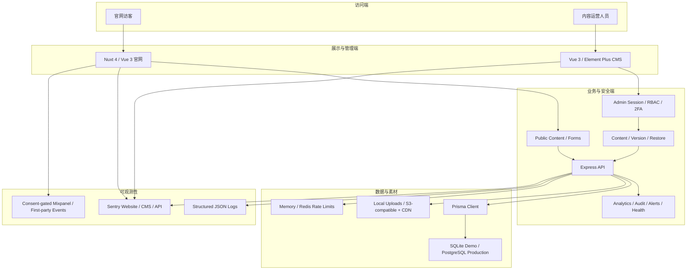
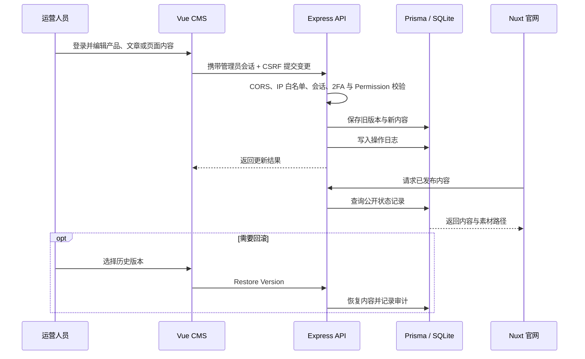
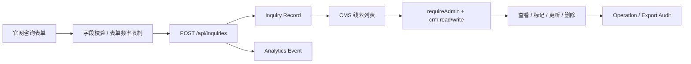
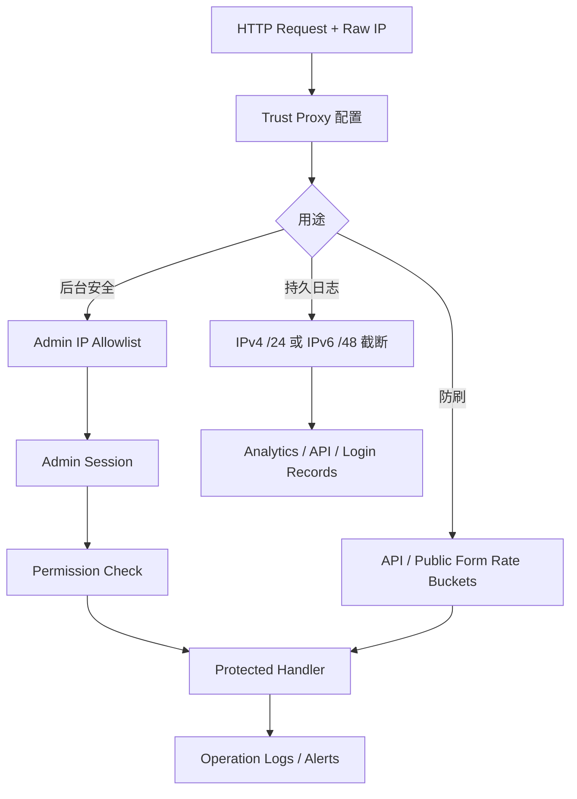
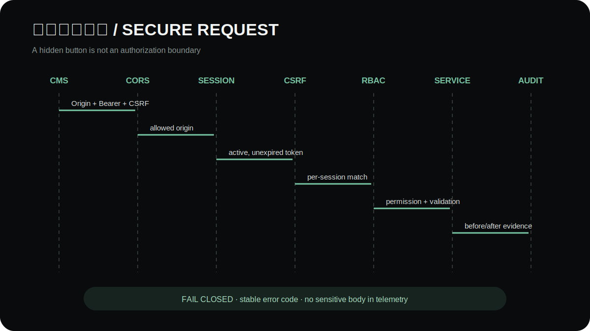
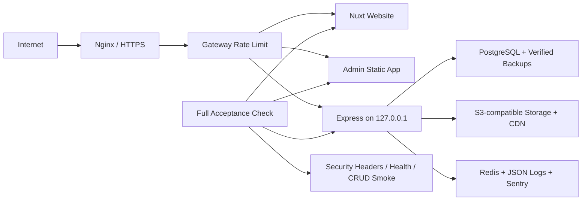

# 架构说明

**简体中文** · [English](en/architecture.md)

下文从系统、发布、公开线索、安全与生产五个视角说明边界。如果只需了解用户如何完成浏览到咨询，先阅读 [产品与用户旅程](product-tour.md)；如果需要调用 API，阅读 [API 使用指南](api-reference.md)。

## 1. 官网、CMS 与 API 三端架构

前台只消费公开内容接口并提交公开表单；后台的写操作必须经过管理员会话、每会话 CSRF token 和权限点校验。API 是唯一数据边界，前端不直接连接数据库或读写上传目录。产品和询价域已分成 route → controller → service → repository，校验和 permission 为独立边界。

## 2. CMS 内容发布与版本恢复

演示 seed 生成的是完整虚构品牌数据；产品、文章、FAQ 和页面内容不依赖历史线上服务器，便于本地复现三端闭环。

## 3. 公开咨询线索流

公开表单不复用宽松的普通内容读取路径：它有独立的请求桶、honeypot/时间守卫、字段校验和持久化记录；线索的读取、修改与导出只允许具备 CRM 权限的后台用户执行。分析仅记录 `inquiry_submit` 与非 PII 上下文，不复制姓名、电话、城市或留言。

## 4. 鉴权、限流与日志隐私边界

IP 匿名化只发生在持久日志写库处。限流键与管理员 IP 白名单继续使用原始 IP，否则会降低防刷和访问控制的准确性。应用内存限流是单实例兜底，`RATE_LIMIT_STORE=redis` 通过共享适配器支持多实例，边缘/WAF 仍应作为第一道防线。

## 5. 生产部署与验收边界

- 开发态默认只监听回环地址；弱默认凭据与非本地监听组合会直接拒绝启动。
- 生产启动会检查管理员账号、密码、Token 等关键配置，前后台生产构建会拒绝 localhost API 地址。
- 上线验收脚本同时探测官网、后台和 API，并检查后台安全响应头，而不是只验证构建目录存在。
- SQLite 与本地上传保留为可复现 Demo 模式；多实例 production 使用已提供的 PostgreSQL、S3-compatible、Redis 和集中日志适配边界。
