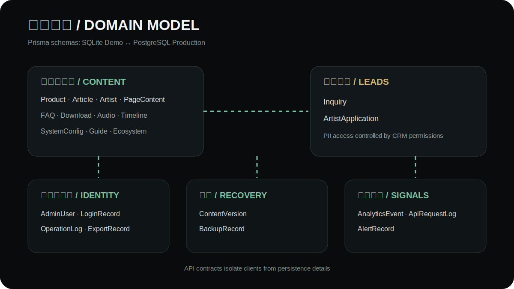
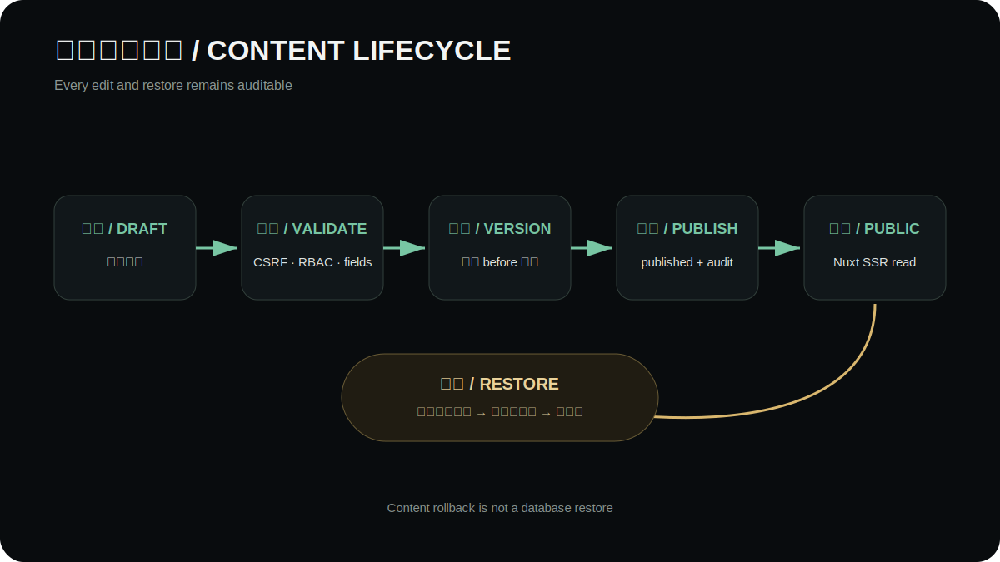

# 数据模型与内容生命周期

**简体中文** · [English](en/data-model.md)

API 通过 Prisma 同时维护 SQLite Demo schema 与 PostgreSQL production schema。前端不直接依赖数据库字段，所有读写经 API 合同完成。

## 领域分组

| 领域 | 模型 | 主要用途 |
| --- | --- | --- |
| 商品与内容 | `Product`, `Article`, `Artist`, `PageContent` | 产品、新闻、艺术家和页面内容 |
| 支持内容 | `SupportFaq`, `SupportDownload`, `AudioSolution`, `AudioStat`, `BrandTimeline`, `EcosystemService`, `QuickGuide` | FAQ、下载、方案与品牌内容 |
| 线索 | `Inquiry`, `ArtistApplication` | 咨询、试奏、售后与艺术家申请 |
| 身份与审计 | `AdminUser`, `LoginRecord`, `OperationLog`, `ExportRecord` | 管理员、登录、变更和导出证据 |
| 恢复 | `ContentVersion`, `BackupRecord` | 内容快照和数据库备份记录 |
| 可观测性 | `AnalyticsEvent`, `ApiRequestLog`, `AlertRecord` | 转化、请求质量与告警 |
| 全局配置 | `SystemConfig` | 首页、联系方式和品牌素材 |

## 内容生命周期

1. 编辑器创建或修改草稿。
2. API 校验字段、权限和 CSRF，并保存变更前版本。
3. 内容切换为 `published` 后才进入官网公开读取。
4. 每次编辑和恢复都生成操作审计；恢复本身也产生新证据。
5. 数据库恢复只用于事故级恢复，不代替内容版本回滚。

产品和文章还可使用 `availableFrom`、`availableUntil`、`publishedAt`、`hiddenAt` 表达发布时间窗口。调用方不能只根据 ID 推断草稿可公开。

## SQLite 与 PostgreSQL

- SQLite 用于本地 Demo、测试和单实例复现，数据库文件不提交。
- PostgreSQL 用于 staging/production，迁移位于独立 schema 目录并由部署命令执行。
- 两套 schema 应保持模型和业务语义一致；CI 同时执行 Prisma validate。
- 多实例状态放在 PostgreSQL、Redis 和对象存储，不依赖容器本地磁盘。

## PII 与保留

- `Inquiry` 和 `ArtistApplication` 包含联系方式，只向具备相应权限的后台角色开放。
- 分析事件不得复制姓名、电话、邮箱、地址、留言、token 或 cookie。
- 请求日志只记录诊断字段，body、headers 和 query 默认不进入错误平台。
- 保留期由环境变量控制；删除、导出和备份操作必须留下审计证据。

## schema 变更规则

1. 同步修改 SQLite 与 PostgreSQL schema。
2. 为 PostgreSQL 提交可部署迁移，不在生产使用 `migrate dev`。
3. 更新验证、服务、仓储和 API 文档。
4. 增加迁移前备份、迁移后健康和回滚说明。
5. 运行双 schema 校验、集成测试和备份恢复演练。
