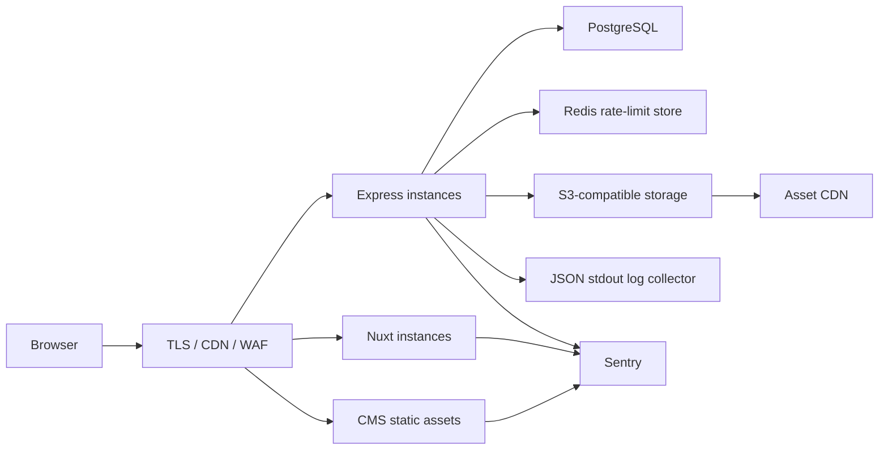

# 部署、迁移、备份与回滚

## 环境分层

| 环境 | 数据库 | 素材 | 限流 | 用途 |
| --- | --- | --- | --- | --- |
| local/demo | SQLite | 本地 `uploads` | 进程内存 | 可复现开发与演示 |
| staging | SQLite 单实例或 PostgreSQL | 独立 bucket/CDN | Redis 建议 | 数据脱敏后的发布验证 |
| production | PostgreSQL | S3 兼容对象存储 + CDN | Redis | 多实例、可水平扩展 |

三端分别从 `aural-api/.env.*.example`、`aural-website/.env.*.example` 和 `aural-admin/.env.*.example` 创建实际配置。示例值不是可用密钥；production preflight 会主动拒绝它们。

## 生产拓扑



API 使用 `DATABASE_URL` 自动选择 Prisma schema：`file:` 使用 SQLite，`postgresql:` 使用 `prisma/postgresql/schema.prisma`。`UPLOAD_STORAGE=s3` 启用对象存储适配器，`S3_PUBLIC_BASE` 是返回给客户端的 CDN 域名。`RATE_LIMIT_STORE=redis` 把限流计数器放到共享 Redis。

## 发布前

```bash
npm run install:all
npm run seed:demo
npm run lint
npm run test
npm run test:e2e
npm run backup:verify
npm run quality
```

用真实 production 环境变量执行：

```bash
cd aural-api
npm run preflight
npm run backup:db
npm run db:deploy
```

`db:deploy` 仅执行已提交的 `prisma migrate deploy`，不在生产创建交互式迁移。先在 staging 用生产同版本 PostgreSQL 验证迁移时间和锁表影响。

## 发布顺序

1. 生成唯一 `SENTRY_RELEASE` 和发布 ID，构建官网与 CMS，上传 source maps。
2. 创建数据库备份并校验大小/完整性。
3. 执行前向兼容的数据库迁移。对删字段等破坏性改动使用 expand/migrate/contract 两次发布。
4. 先发布 API，健康检查通过后切换流量；再发布 Nuxt 与 CMS 静态产物。
5. 执行 `node aural-api/scripts/post-deploy-check.js`，确认 API 健康、CMS 登录、官网首页与构建中 API 域名。
6. 使用无客户 PII 的测试线索走完产品→对比→询价→CMS 处理，监控 5xx、p95 和 Sentry 新问题。

`npm --prefix aural-api run deploy:safe -- <stage-directory>` 可用于现有 rsync/PM2 单机部署，它会执行 guard、数据库检查、发布前备份、构建验证、重启和 post-deploy smoke，并写入发布历史。容器/Kubernetes 环境应将同等步骤编排到平台 pipeline。

## 备份与恢复

- SQLite：备份使用 `sqlite3 .backup` 获取一致快照，然后执行 `PRAGMA integrity_check`。
- PostgreSQL：备份使用 `pg_dump --format=custom --no-owner`。生产还应启用数据库服务的 PITR/WAL 归档。
- `npm run backup:verify` 会在临时目录中恢复 Demo SQLite，比较 Product/AdminUser 行数并检查完整性。
- PostgreSQL 备份至少每月在隔离库执行 `pg_restore --clean --if-exists --no-owner` 演练，记录 RPO/RTO，不在生产主库演练。

## 回滚

1. 停止继续扩大流量，记录当前发布 ID 和 Sentry release。
2. 如果数据库迁移保持向后兼容，先把 API/Nuxt/CMS 切回上一个不可变镜像或 release 目录，再运行 post-deploy smoke。
3. 如果必须恢复数据，先暂停写入、再备份当前状态，在隔离环境校验目标备份后才恢复。这是有数据损失风险的独立决策，不与应用回滚默认绑定。
4. 恢复后重新运行 Prisma validate、API health、CMS 登录、公开查询和询价提交写入。
5. 记录事件时间线、丢失数据窗口、根因与防回归测试。

## 密钥与日志

密钥使用云密钥管理或 CI environment secrets 注入。S3 凭据不得以 `NUXT_PUBLIC_*`/`VITE_*` 前缀暴露。API 向 stdout 输出 JSON，由平台收集到可搜索日志系统；日志系统的存储周期与访问权限应与审计策略一致。
