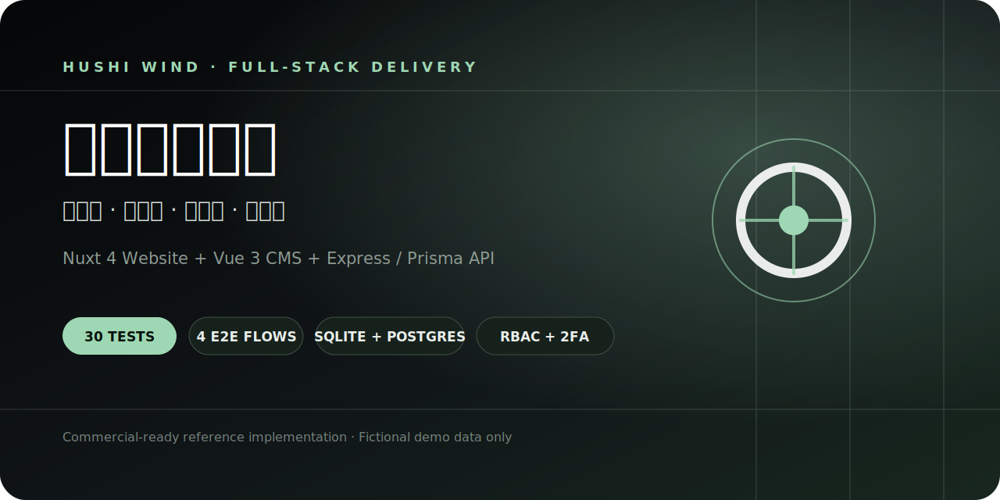

# 文档导航

**简体中文** · [English](en/documentation-index.md)

这里是胡氏管乐三端项目的文档入口。不需要从头阅读所有文件；先按自己的角色选择最短路径。

## 我只想跑起项目

1. 阅读主 [README](../README.md#本地复现)。
2. 执行 `npm run install:all`、`npm run seed:demo`、`npm run dev`。
3. 按 [3 分钟演示脚本](demo-script.md) 走完官网、CMS 和 API。
4. 使用完毕后再次执行 `npm run seed:demo` 恢复虚构基线。

## 我负责产品或业务

- [产品与用户旅程](product-tour.md)：查看从品牌首页、产品搜索、对比到咨询的完整路径。
- [转化事件规范](analytics.md)：理解六个事件、funnel 和 PII 边界。
- [已知边界](known-limitations.md)：区分已实现的交付能力与仍需真实 staging 验证的部分。

## 我负责 CMS 运营

- [CMS 运营手册](admin-guide.md)：登录、日常工作台、内容发布、版本恢复、CRM、资源库与安全巡检。
- [RBAC 与安全模型](security-and-permissions.md)：会话、权限点、2FA、CSRF、默认凭据和审计边界。
- [Release Checklist](release-checklist.md)：发布前后的可勾选清单。
- [安全报告规范](../SECURITY.md)：发现漏洞时的私密报告方式。

## 我负责开发或集成

- [开发者指南](developer-guide.md)：仓库结构、本地开发循环、分层约束和提交前自检。
- [架构说明](architecture.md)：三端边界、内容发布时序、咨询数据流和鉴权边界。
- [API 使用指南](api-reference.md)：公开与受保护端点、会话/CSRF、错误响应和上传约定。
- [环境变量参考](configuration-reference.md)：三端配置、环境差异、存储/限流/监控开关。
- [数据模型与内容生命周期](data-model.md)：核心实体、公开状态、版本和恢复语义。
- [设计系统与无障碍](design-system-and-accessibility.md)：视觉令牌、状态组件、键盘和响应式规则。
- [技术说明](technical-notes.md)：技术选型与明确的规模边界。
- [测试与验收](testing-and-acceptance.md)：单测、集成、E2E、视口、axe 和性能口径。

## 我负责部署或值班

- [部署、迁移、备份与回滚](deployment.md)：环境分层、生产拓扑、迁移和回滚决策。
- [运维 Runbook](operations-runbook.md)：日常检查、告警分级、故障处理、备份恢复和事后复盘。
- [可观测性与告警](observability.md)：三端 Sentry、JSON 日志、阈值和发布观察窗口。
- [常见故障排查](troubleshooting.md)：安装、端口、登录、构建、上传、备份和恢复问题。

## 命令速查

| 目的 | 命令 |
| --- | --- |
| 安装三端 | `npm run install:all` |
| 重置 Demo | `npm run seed:demo` |
| 启动三端 | `npm run dev` |
| 校验双语文档与图片 | `npm run docs:check` |
| 全部单元/集成测试 | `npm run test` |
| 完整 E2E | `npm run test:e2e` |
| 备份恢复演练 | `npm run backup:verify` |
| 交付质量门禁 | `npm run quality` |
| 生产配置预检 | `npm --prefix aural-api run preflight` |
| 已提交迁移部署 | `npm --prefix aural-api run db:deploy` |

## 文档也是交付物

新增功能时，同一个 PR 应同时更新：

1. 面向使用者的操作说明。
2. API/配置/权限合同。
3. 自动化测试与验收证据。
4. 会受影响的架构、部署、监控或回滚说明。
5. 界面发生明显变化时更新真实截图，不使用设计稿假装已实现。
