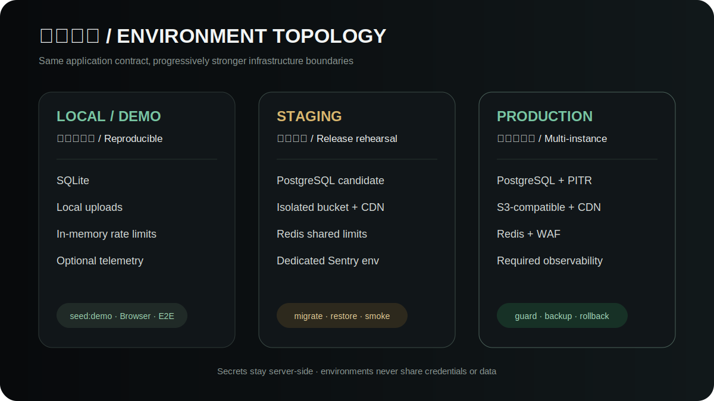

# Configuration reference

[简体中文](../configuration-reference.md) · **English**

Environment templates are the source of truth. This guide explains purposes and trust boundaries without providing production-ready secrets.

## Rules

- Browser-visible values may contain public URLs, environment/release names, and public feature flags only.
- Database, Redis, S3, administrator and source-map credentials remain server/build-side.
- Staging and production use isolated data, buckets, Redis, Sentry environments and accounts.

## API groups

| Group | Variables |
| --- | --- |
| Runtime/data | `NODE_ENV`, `DEPLOYMENT_MODE`, `PORT`, `DATABASE_URL` |
| Public URLs/CORS | `PUBLIC_SITE_URL`, `PUBLIC_ADMIN_URL`, `API_PUBLIC_URL`, `UPLOAD_PUBLIC_BASE`, `ALLOWED_ORIGINS` |
| Admin/session | `ADMIN_USERNAME`, `ADMIN_PASSWORD`, `ADMIN_TOKEN_SECRET`, `ADMIN_TOKEN_TTL_MS`, `ADMIN_IP_ALLOWLIST` |
| Limits | `PUBLIC_FORM_*`, `API_RATE_*`, `RATE_LIMIT_STORE`, `REDIS_URL` |
| Uploads | `MAX_UPLOAD_BYTES`, `MAX_IMAGE_PIXELS`, `CLAMAV_SCAN_COMMAND`, `UPLOAD_STORAGE`, `S3_*` |
| Alerts/retention | `ALERT_*`, `*_RETENTION_DAYS` |
| Monitoring/processes | `OBSERVABILITY_REQUIRED`, `SENTRY_*`, `API_PM2_NAME`, `WEB_PM2_NAME` |

## Clients

CMS uses `VITE_API_BASE`, `VITE_SITE_URL`, the public sensitive-operation phrase, and `VITE_SENTRY_*`. Nuxt separates browser `NUXT_PUBLIC_*` values from `NUXT_API_INTERNAL_BASE` and server-side `SENTRY_*`; source-map credentials exist only during CI builds.

Run API `preflight`, `deploy:guard`, and `check:api` before production. Guards must reject Demo credentials, placeholders, SQLite multi-instance mode, local persistent uploads and in-memory shared limits.
