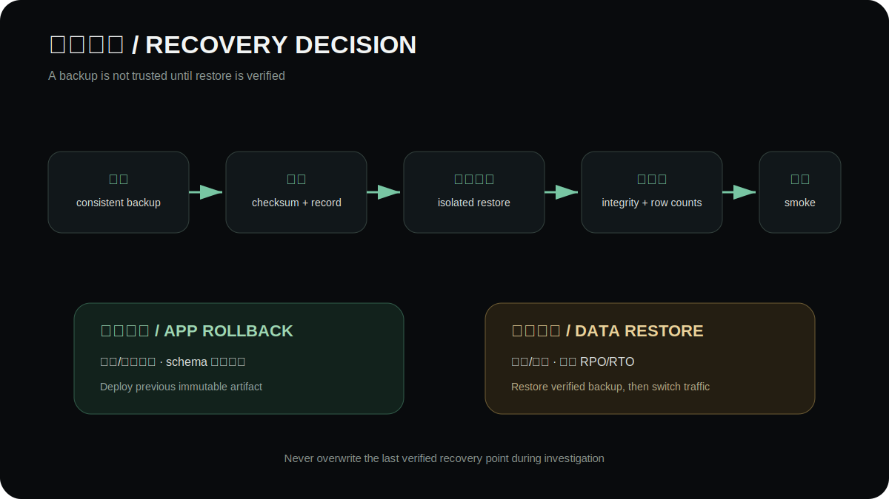

# Deployment, migration, backup and rollback

[简体中文](../deployment.md) · **English**

## Environments

Local/Demo uses SQLite, local uploads and memory limits. Staging uses isolated PostgreSQL/bucket/Redis/Sentry candidates. Production uses PostgreSQL with recovery, S3-compatible storage/CDN, Redis, trusted HTTPS proxy and required observability.

## Before release

- Run `npm run quality` and review E2E/build artifacts.
- Validate production variables with API preflight and deploy guard.
- Create and verify a backup before migrations.
- Confirm immutable release id, source maps, alert channels and rollback artifact.
- Verify no Demo credentials, sample domains or local-only state remain.

## Order

1. Freeze an immutable release artifact.
2. Create/verify backup and record recovery point.
3. Run committed Prisma production migrations.
4. Deploy API and verify `/health`.
5. Deploy Nuxt and CMS with matching release/configuration.
6. Run public and authenticated business smoke flows.
7. Observe errors, latency, uploads and conversion for 30 minutes.

## Backup and recovery

SQLite Demo uses consistent backup plus integrity/row-count verification. PostgreSQL recovery is rehearsed in isolation with explicit RPO/RTO. A backup is not trusted until restoration succeeds.

## Rollback

Use application rollback for code/configuration faults when schema remains compatible. Use data recovery only for corruption or destructive data loss. Never overwrite the last verified recovery point while investigating.

See the [operations runbook](operations-runbook.md) for incident decisions and evidence.
