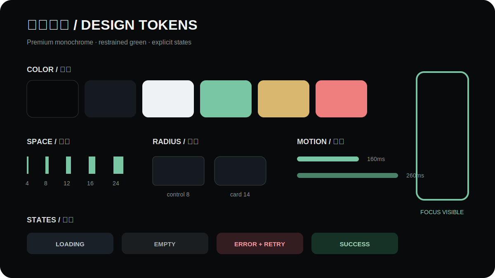

# Design system and accessibility

[简体中文](../design-system-and-accessibility.md) · **English**

The public website retains a premium monochrome language while the CMS uses a dense operations surface. Tokens, states and accessibility rules align their behavior without forcing identical components.

## Foundations

- Black, graphite and white dominate; green signals action/success and gold is restrained.
- Spacing follows 4/8/12/16/24; controls use roughly 8px radii and cards 14px.
- Transitions stay around 160–260ms and information never depends on animation alone.
- Every data view defines loading, empty, error/retry, success and permission states.

## Accessibility

- All controls are keyboard reachable with visible `:focus-visible` treatment.
- Dialog focus is trapped, Escape closes non-destructive overlays, and focus returns to the trigger.
- Headings, landmarks, skip links and alt text support assistive navigation.
- `prefers-reduced-motion` removes nonessential movement.
- Images reserve dimensions/aspect ratio; real product media must have verifiable rights.

Acceptance covers 1440×900, 834×1112, 393×852, 200% zoom, long text and touch targets. Documentation screenshots use a fresh fictional seed and true PNG encoding.
