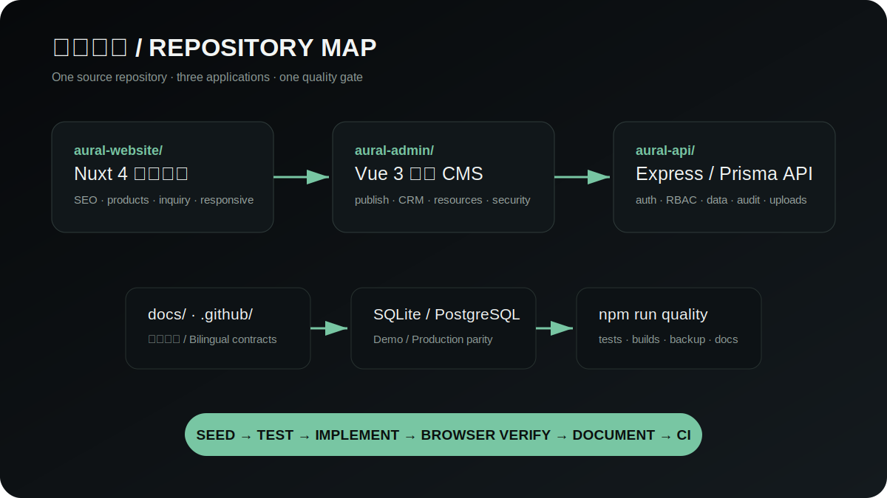

# Developer guide

[简体中文](../developer-guide.md) · **English**

This guide takes a new contributor from a clean clone to a verifiable three-application development loop.



## Prerequisites and startup

- Node.js 22+, npm 10+, `sqlite3` CLI, and Chromium for E2E.
- PostgreSQL, Redis and S3 are not required for the local Demo.

```bash
npm run install:all
npm run seed:demo
npm run dev
```

Website runs on 3000, CMS on 5175, and API on 1337. The local account is `demo_admin / DemoPass_2026!` and is rejected by production guards.

## Boundaries

- Nuxt owns public reads, SEO, responsive interaction and public forms.
- CMS owns content, CRM, resources and security operations.
- API owns data, uploads, auth, audit, limits and observability.
- Product and inquiry domains follow route → controller → service → repository.

## Development loop

1. Seed a deterministic fictional baseline.
2. Add or update tests with behavior changes.
3. Start only the applications needed for fast feedback.
4. Run focused checks, then `npm run quality`.
5. Verify visible changes with Browser at desktop, tablet and mobile sizes.
6. Update contracts and screenshots in both languages.

See [Contributing](../../CONTRIBUTING.md) for PR evidence and security rules.
