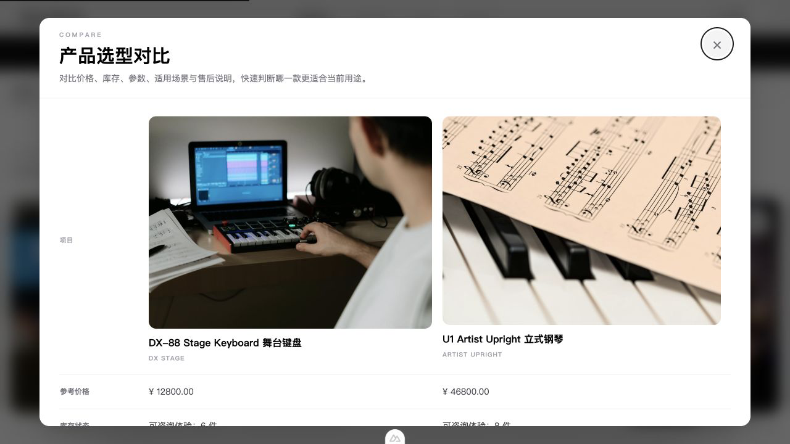
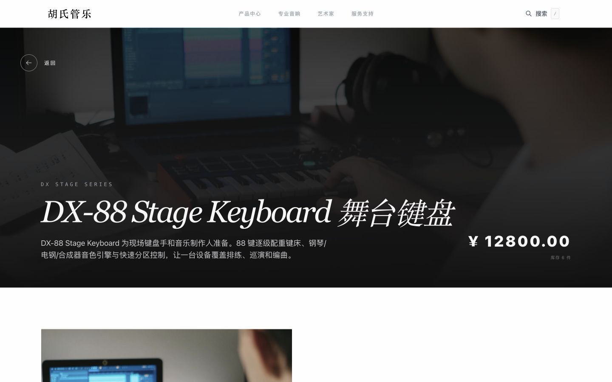
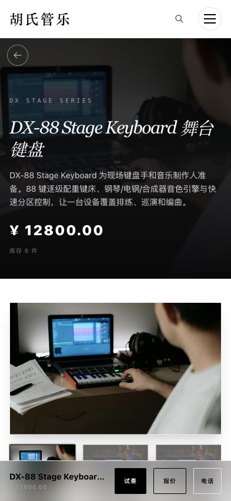
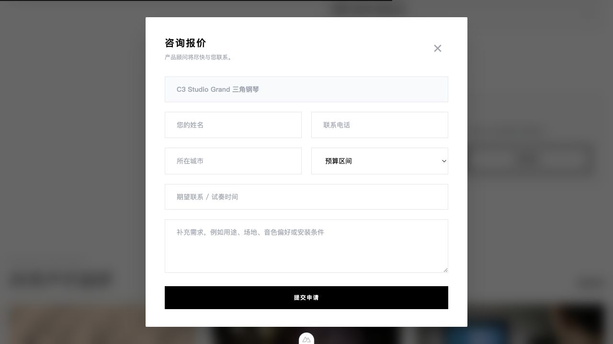
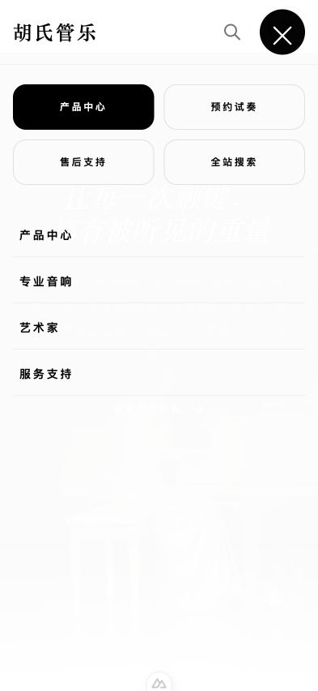

# Product and customer journey

[简体中文](../product-tour.md) · **English**

This journey follows a visitor from brand context to selection, inquiry and CMS follow-up.

## Home and catalog

The homepage establishes trust and routes visitors toward products, support and brand material. The catalog combines keywords, category, price/availability and sorting without hiding the current filter state.

## Comparison and detail

Visitors can compare up to three products on a scan-friendly surface. The modal traps focus, closes with Escape and returns focus to its trigger. Product detail presents specifications, scenes, warranty, related items and a persistent next step without inventing price or certification claims.

| Desktop detail | Mobile detail |
| --- | --- |
|  |  |

## Inquiry

The form requests only necessary contact and selection context, uses bot/time/rate protections, and reports success only after API `201`. Product analytics receives the event type and safe product context, never the form body.

## CMS follow-up

| Operations dashboard | Inquiry queue |
| --- | --- |
|  |  |

New inquiries become auditable CRM work. Permissions govern private fields, status changes and exports. Content can be published and restored without bypassing the same API boundary.

## Responsive acceptance

| Tablet | Mobile filters | Mobile navigation |
| --- | --- | --- |
|  |  |  |

Acceptance covers browse → filter → compare → detail → inquiry → CMS follow-up on keyboard, desktop, tablet and phone.
