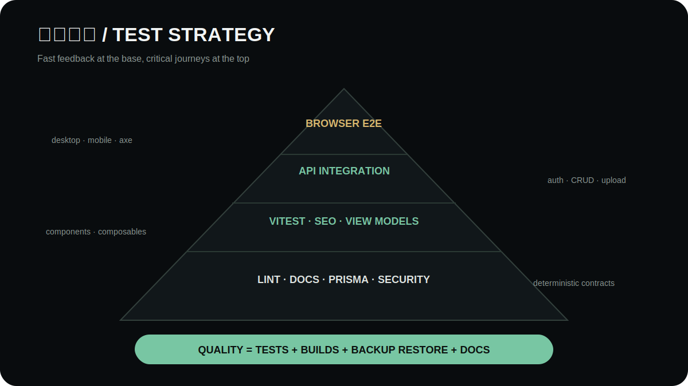

# Testing, baseline and acceptance

[简体中文](../testing-and-acceptance.md) · **English**



## Automated layers

| Layer | Focus |
| --- | --- |
| Documentation | Links, anchors, images, alt, MIME, SVG metadata and language pairs |
| Website unit | Components, filtering, SEO, JSON-LD and analytics privacy |
| CMS unit | Session/CSRF and dashboard/security view models |
| API integration | Health, auth, RBAC, CSRF, CRUD, uploads, inquiry, restore and production guards |
| Browser E2E | Browse/search/compare/inquiry, CMS publish/rollback, responsive and axe |
| Recovery | Consistent backup, restore, integrity and row counts |
| Build/security | Nuxt/CMS production builds, Prisma validation and production dependency audit |

## Browser acceptance

Verify 1440×900 desktop, 834×1112 tablet and 393×852 phone. Cover keyboard-only navigation, visible focus, dialog focus return, reduced motion, 200% zoom, loading/empty/error/retry, and the complete product → comparison → inquiry → CMS path.

## Performance and accessibility evidence

Results must name the commit, environment, viewport, tool and date. Do not present local synthetic values as production SLOs. Re-run with real production content and target infrastructure before launch.

## Gate

```bash
npm run docs:check
npm run quality
```

CI must publish build and Playwright artifacts even when E2E fails, so the failure remains diagnosable.
