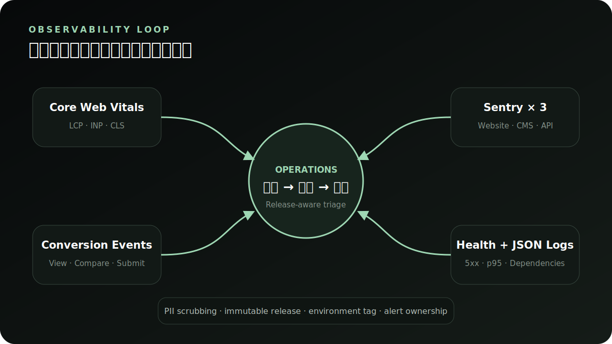

# 可观测性与告警

## 三端 Sentry

| 端 | SDK | 关键配置 | 默认隐私 |
| --- | --- | --- | --- |
| Express API | `@sentry/node` | `SENTRY_DSN`, `SENTRY_RELEASE`, `SENTRY_ENVIRONMENT` | 删除 user、cookies、body、headers、query string |
| Nuxt website | `@sentry/nuxt` | server/client DSN，相同 release | 不发送默认 PII，仅上传 production source maps |
| Vue CMS | `@sentry/vue` | `VITE_SENTRY_DSN`, `VITE_SENTRY_RELEASE` | 不记录表单值和会话 token |

三端必须使用同一个不可变 release 标识（建议 Git SHA）和准确 environment。`SENTRY_AUTH_TOKEN`、org 和 project 只在构建环境中用于 source-map 上传，不进入客户端产物。Nuxt 仅在 `NUXT_PUBLIC_SENTRY_DSN` 或 `SENTRY_DSN` 存在时注入 SDK；只有 `SENTRY_AUTH_TOKEN` / `SENTRY_ORG` / `SENTRY_PROJECT` 同时存在时才生成并上传 source maps，无监控的 Demo 构建不会承担 SDK 体积。production 建议 trace sample rate 从 0.05 开始，在成本与诊断需求间调整。

## 应用日志与健康

API 向 stdout 输出单行 JSON，包括 timestamp、level、service、environment、message、method、path、status 和 duration。持久化 IP 使用匿名化网段；限流和 IP allowlist 仍在内存中使用原始 IP，两者不应混用。

`/health` 检查 API 进程、核心 Prisma 表和 SQLite 文件（如适用）。不在 health 输出 DSN、密钥或完整错误堆栈。容器 readiness 只在 health 成功时引流，liveness 不应因短暂外部依赖抖动频繁重启进程。

## 建议告警

- 5 分钟内 API 5xx 率 > 2% 或连续健康检查失败：P1。
- CMS 登录失败/锁定激增、备份失败、对象存储写入失败：P1/P2。
- p95 API > 800ms 持续 10 分钟，Nuxt LCP p75 > 2.5s，INP p75 > 200ms，CLS p75 > 0.1：P2。
- `inquiry_start` 正常但 `inquiry_submit` 降为历史基线的 50% 以下：P2 转化回归。
- 单一 Sentry 新 issue 影响 5% 以上会话，或 release health crash-free sessions 明显下降：暂停发布。

API 现有 alert webhook 可用 `ALERT_WEBHOOK_URL` 外接值班系统；先用 `npm --prefix aural-api run alert:test` 在 staging 验证路由。告警载荷不得包含询价表单值。

## 发布观察窗口

发布后至少观察 30 分钟：健康检查、5xx、p95、Redis/S3 错误、CMS 登录、询价提交、Sentry 新 issue 和转化漏斗。将发布 ID、Git SHA、数据库迁移版本和上一 release 记入发布记录，便于快速回滚。
