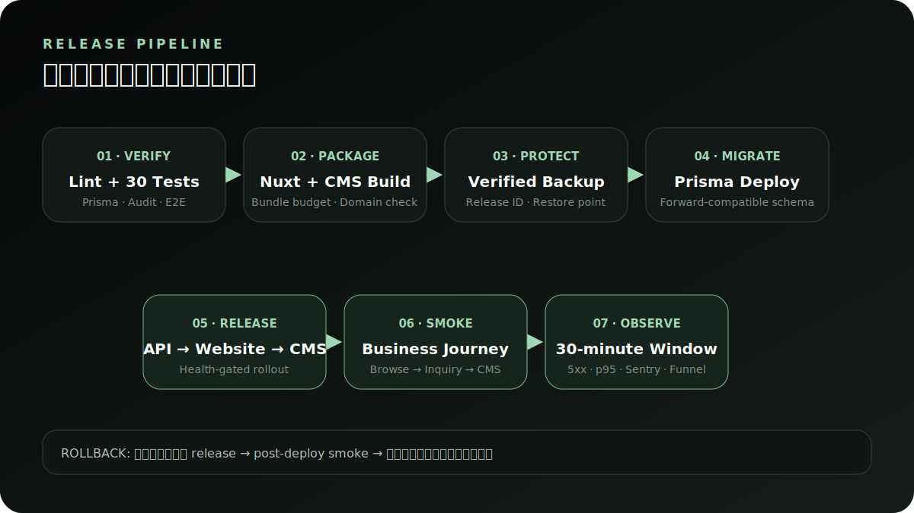

# 运维 Runbook

**简体中文** · [English](en/operations-runbook.md)

这份 Runbook 面向 staging/production 值班、发布负责人和事故处理人。它不存放任何真实凭据；应在团队密钥管理和值班系统中补充平台特定地址、联系人和操作权限。


## 生产服务目录

| 组件 | 职责 | 核心依赖 | 首要检查 |
| --- | --- | --- | --- |
| Nuxt Website | SSR、SEO、公开用户旅程 | API、CDN | 首页/产品页 2xx、错误率、LCP/INP/CLS |
| Vue CMS | 内容、CRM、安全与运营 | API | 静态资源、登录、会话、关键列表 |
| Express API | 业务、鉴权、审计、健康 | PostgreSQL、Redis、S3 | `/health`、5xx、p95、依赖错误 |
| PostgreSQL | 业务与审计数据 | 磁盘、PITR/WAL | 连接、容量、慢查询、备份 |
| Redis | 共享限流 | 内存、网络 | 连接、驱逐、键数与延迟 |
| S3/CDN | 产品和内容素材 | bucket、签名、域名 | 读写、CDN 4xx/5xx、缓存命中 |
| Sentry/Logs | 错误、release 和请求证据 | DSN、日志采集 | 事件流入、release 匹配、PII 脱敏 |

## 事故分级

| 等级 | 判定 | 目标响应 | 示例 |
| --- | --- | --- | --- |
| P1 | 主要路径不可用、数据丢失/泄露风险 | 立即响应，暂停发布 | API 连续失败、CMS 无法登录、误删生产数据 |
| P2 | 部分功能严重退化或转化异常 | 15 分钟内开始处理 | 咨询提交失败、p95 持续超标、新 release 错误激增 |
| P3 | 有替代路径的局部问题 | 工作时间处理 | 个别素材失败、非核心页文案/布局问题 |

发现潜在泄露、未授权访问、恶意上传或凭据暴露时，优先按 P1 处理，并遵循 [SECURITY.md](../SECURITY.md) 的私密通报边界。

## 通用初始响应

1. 确认影响面：官网、CMS、API、特定功能还是单个账号。
2. 记录开始时间、首次发现人、当前 release/Git SHA、环境和最近发布。
3. 查看 `/health`、平台实例健康、Sentry 新 issue、JSON 日志和数据库/存储依赖。
4. 保护证据：不要通过删除日志、重置数据库或反复重启破坏现场。
5. 如与新 release 明显相关，暂停继续放量，准备回滚上一不可变产物。
6. 对外沟通只描述已确认的影响、当前动作和下次更新时间。

## API 或官网大量 5xx

```bash
curl -fsS https://api.example.com/health
```

1. 区分网关、Nuxt SSR 和 API 响应失败。
2. 按 release 和 route 聚合 Sentry/JSON 日志，查看首个错误而不只看后续级联错误。
3. 检查 PostgreSQL 连接、慢查询、磁盘、Redis 和 S3 错误。
4. 如新迁移导致不兼容，先判断上一 API 是否与当前 schema 向后兼容。
5. 可安全回滚时切回上一 release，随即执行 post-deploy smoke。
6. 如不能回滚，使用最小缓解（禁用有问题功能、降低流量、恢复依赖）并保留证据。

## CMS 无法登录

1. 确认 CMS 静态文件和 API 域名均可达，不是过期的 localhost 构建。
2. 检查 Origin/CORS、管理员 IP 白名单和代理层真实 IP 配置。
3. 查看 login records 中的账号停用、锁定、密码错误或 2FA 错误，不在公开频道粘贴完整记录。
4. 如为个别账号，由另一已验证的超级管理员按流程重置，不直接修改数据库 hash。
5. 修改/重置密码后确认旧会话已失效并保留审计记录。

## 咨询打开正常但提交下降

1. 对比 `inquiry_start` 与 `inquiry_submit`，确认是流量变化还是提交步骤回归。
2. 查看表单 API status、限流命中、validation code 和前端 API 失败，不查看/导出表单原始内容作为默认排查手段。
3. 在 staging 用明确标记的虚构数据走完实际提交。
4. 检查 CMS 线索列表是否可读，区分“写入失败”和“后台查询失败”。
5. 将响应中的错误 code、release 与时间窗口纳入事故记录，不记录客户表单值。

## 对象存储或 CDN 失败

1. 区分新上传失败、源站读取失败与 CDN 缓存/域名失败。
2. 检查 bucket、region、endpoint、凭据权限、时钟偏差和 `S3_PUBLIC_BASE`。
3. 验证失败对象是否存在，不通过公开 bucket/list 权限缓解。
4. 如新素材导致官网问题，在 CMS 恢复上一内容版本或替换为已验证素材。
5. CDN 恢复后只对已确认变更路径做最小刷新，避免全量缓存雪崩。

## 备份与恢复

### 备份

```bash
npm --prefix aural-api run preflight
npm --prefix aural-api run backup:db
```

- SQLite 使用 `.backup` 获取一致快照并执行 `PRAGMA integrity_check`。
- PostgreSQL 使用 `pg_dump --format=custom --no-owner`，生产同时开启托管数据库 PITR/WAL。
- 备份必须有保留期、加密、访问控制和失败告警。

### 恢复演练

Demo/CI：

```bash
npm run backup:verify
```

PostgreSQL 至少每月在隔离库执行 `pg_restore --clean --if-exists --no-owner`，比对核心表、关键业务记录与 Prisma schema，并记录 RPO/RTO。

在生产主库恢复是有数据丢失风险的独立决策：先暂停写入，备份当前状态，在隔离环境验证目标备份，再由授权人批准。

## 发布与回滚



发布必须使用不可变产物和唯一 release ID。详细命令见 [部署文档](deployment.md)，发布负责人同时使用 [Release Checklist](release-checklist.md)。

回滚原则：

- 优先回滚应用产物，不默认回滚数据。
- 只有 schema 向后兼容时才可安全切回上一 API。
- 回滚后立即验证健康、CMS 登录、公开内容、咨询写入与 Sentry 新 issue。
- 恢复数据前明确数据丢失窗口，不把它捆绑到应用回滚按钮。

## 事后复盘模板

1. **摘要**：发生了什么，影响了谁，持续多久。
2. **时间线**：首次异常、告警、响应、缓解、恢复和验证。
3. **根因**：技术和流程因素，不以个人疏忽作为最终解释。
4. **检测缺口**：为什么没有更早发现，告警是否可执行。
5. **恢复证据**：使用了哪个 release/备份，哪些冒烟与业务验证通过。
6. **行动项**：每项包含 owner、优先级、截止日期和可验证完成条件。

复盘中不包含未脱敏客户数据、凭据、cookie、token 或完整请求体。
